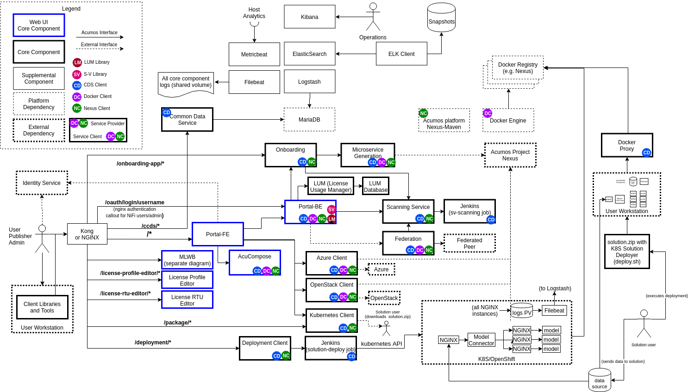
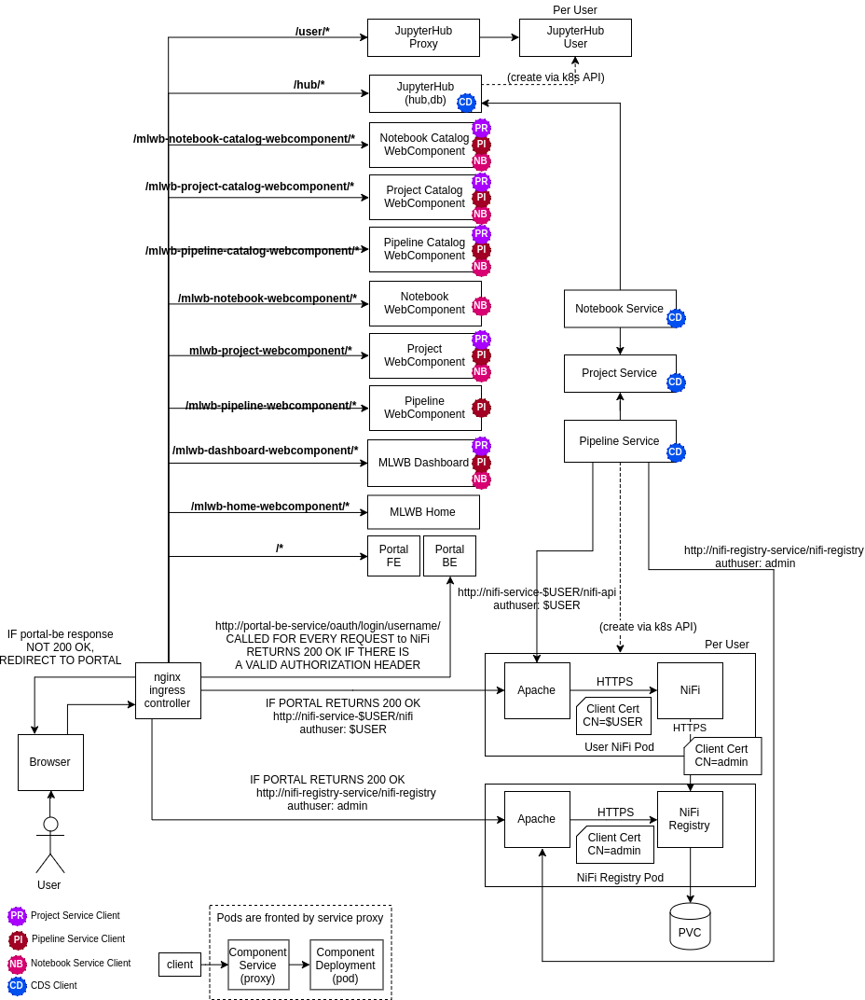
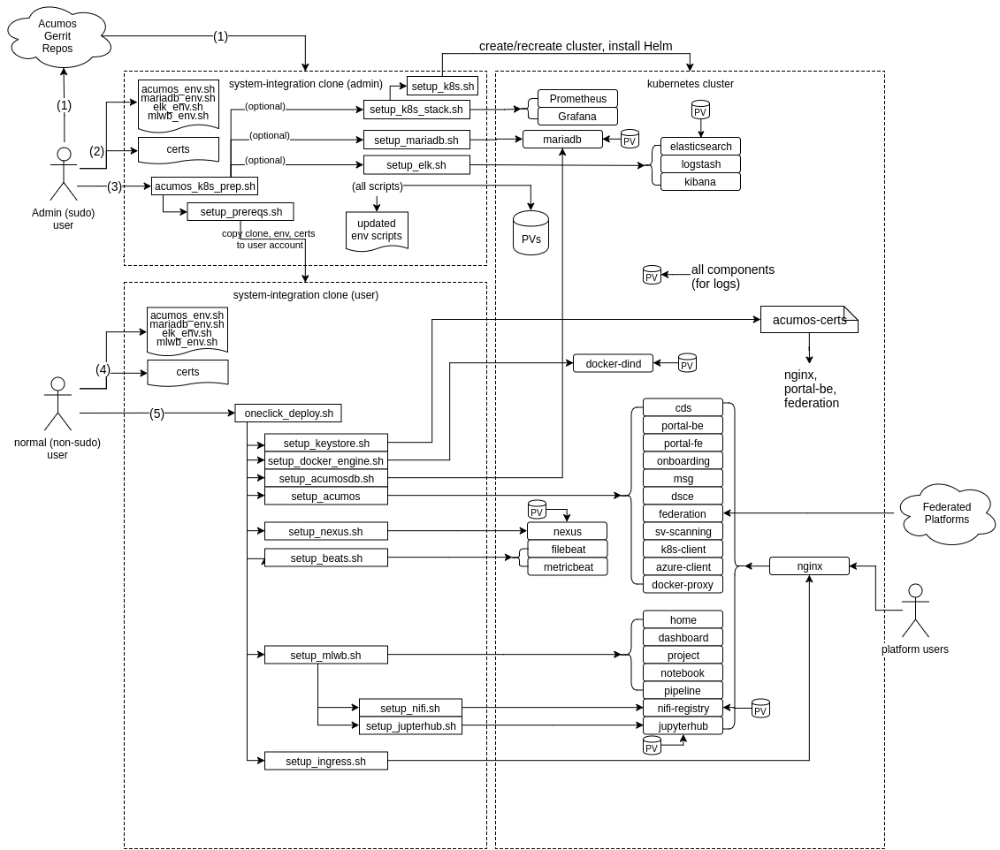

.. ===============LICENSE_START=======================================================
.. Acumos CC-BY-4.0
.. ===================================================================================
.. Copyright (C) 2017-2019 AT&T Intellectual Property & Tech Mahindra. All rights reserved.
.. ===================================================================================
.. This Acumos documentation file is distributed by AT&T and Tech Mahindra
.. under the Creative Commons Attribution 4.0 International License (the "License");
.. you may not use this file except in compliance with the License.
.. You may obtain a copy of the License at
..
.. http://creativecommons.org/licenses/by/4.0
..
.. This file is distributed on an "AS IS" BASIS,
.. See the License for the specific language governing permissions and
.. limitations under the License.
.. ===============LICENSE_END=========================================================

Acumos OneClick / All-in-One (AIO) User Guide
=============================================

This user guide describes how to deploy Acumos platforms using the
"One Click deploy" tools designed for those who want a simple and automated way
to deploy an Acumos platform.

What is an AIO deploy?
----------------------

By default, the AIO deploy tools build an all-in-one instance of Acumos, with
all Acumos data and components running under docker or kubernetes (k8s) on a
single virtual machine or physical host machine.

For k8s based deployments, both generic (standard k8s project tools) and
OpenShift (RedHat's k8s distribution) are supported.

Options allow the user to deploy the platform:

* on a cluster of k8s nodes (note: distributing specific components across nodes
  based upon node labels is planned for future releases)
* with a subset of the components
* to use some components that have previously deployed somewhere, e.g. as a
  shared service

The resulting Acumos platform is illustrated in the following two figures, the
first representing the overall architecture, and the second the architecture of
the MLWB (Machine-Learning Workbench) subsystem.

Quickstart Guide to Platform Deployment (TL;DR)
-----------------------------------------------

NOTICE:

* this process will remove/install software on your target host, and configure
  it e.g. firewall and security rules. Only execute this process if you understand
  the implications or are executing the process in a VM/host that you can easily
  re-create.
* by default, the Acumos platform is deployed with service exposure options
  typical for development environments. Production environments and especially
  public environments will need additional planning and restrictions on exposed
  services, that otherwise could expose your host to security risks. See
  `Security Considerations`_ for recommendations on what/how to lock down as
  needed, for exposure of an AIO-based Acumos platform outside development/test
  environments.

Please make sure you review the host prerequisite requirements under
`Host/VM Preparation`_.

See these specific sections based upon how you want to deploy the platform:

* if you have a server/VM or existing k8s cluster upon which you want to install
  the Acumos platform under k8s, using your local workstation to manage the
  platform, see `Deploying from Your Workstation, via the AIO Deployer Tool`_
* if you have a server/VM upon which you want to directly install/manage the
  Acumos platform under k8s, see:

  * `Deploying as a Privileged (sudo) User`_ if you are a sudo user on that
    server/VM, and want to deploy/manage the platform under your own account
  * `Preparation by Host Admin with Platform Deployment by Normal (non-sudo) User`_
    if you are a sudo user on the server/VM, and want to prepare the server/VM
    for another to install/manage the platform upon.

* `Docker Based Deployment`_, if you want to use the legacy docker-compose
  based method of installation. NOTE not all Boreas release features are
  supported under docker-compose.

Kubernetes Based Deployment
...........................

The process below will support deployment under either a generic kubernetes
distribution, or the OpenShift kubernetes distribution. The scripts will detect
which distribution is installed and deploy per the requirements of that
distribution.

Note: the following k8s versions are explicitly supported and tested by these
tools. Other versions may work, but may require further tool customization.

* "generic" `kubernetes 1.13.8 <https://github.com/kubernetes/kubernetes/releases/tag/v1.13.8>`_
* `OpenShift Origin 3.11 ("OKD") <https://docs.okd.io/3.11/install/running_install.html>`_

Deploying from Your Workstation, via the aio_k8s_deployer
+++++++++++++++++++++++++++++++++++++++++++++++++++++++++

This process supports users with the role of either a cluster admin (full rights
to manage cluster resources) or namespace admin (rights to manage resources
under a namespace). It also minimizes any dependencies/customization of the user's
workstation, by use of a docker container built specifically for deploying and
managing the Acumos platform.

A typical use case for this method is a user who will manage the Acumos platform
on the k8s cluster using kubectl executed from their workstation, after basic
prerequisites have been arranged by the cluster admin:

* allocation of a namespace
* allocation of a platform FQDN (with DNS registration), external IP,
  and setup of an ingress controller for the namespace/FQDN
* setup of persistent volume (PV) resources per Acumos requirements
  (recommended minimum allocations are shown below)

  * logs: 1Gi
  * if deployed as part of the platform, vs use of external instances of these services

    * MariaDB: 10Gi
    * Nexus (Maven repos and docker registry): 10Gi
    * docker-in-docker cache: 10Gi
    * NiFi Registry: 5Gi
    * NiFi users: 5Gi (for each user)
    * JupyterHub: 1Gi
    * Jupyter users: 10Gi (for each user)
    * Elasticsearch: 10Gi

As an option, a user that has cluster admin role can include these prerequisite
steps in the process below.

To use this process, the script aio_k8s_deployer.sh in the tools/aio_k8s_deployer
folder is used, with these prerequisite steps:

* the user has installed, or has access to, a remote k8s cluster (single/multi-node)
* if the k8s cluster does not provide an ingress service with a registered
  DNS name for the platform ingress, the user needs to ensure that the
  external IP address to be used by the ingress controller is registered in DNS
  or configured in the hosts file of their workstation.
* the user has installed a bash shell and docker on their workstation
* the user has created a folder (referred to here as the "staging" folder)
  to contain any customizations to be used in this process, as described below
* the user cloned the system-integration repo into the staging folder as
  subfolder "system-integration"
* the user has prepared any desired customizations in the staging folder,
  as described under `Customizing the aio_k8s_deployer environment`_
* if not providing a k8s config file in the staging folder as described
  in `Customizing the aio_k8s_deployer environment`_, the user has logged into
  the k8s cluster using the applicable client (kubectl or oc), so that the
  correct k8s config is present in ~/.kube/config

Given those prerequisites, in the simplest case the deployment can be launched
with the single command below:

.. code-block:: bash

  $ bash system-integration/tools/tools/aio_k8s_deployer/aio_k8s_deployer.sh \
    all <host> <user> <k8s distribution>
..

where:

* all: build the acumos_deployer image, prep, and deploy the platform
* host: hostname of k8s cluster master node
* user: SSH-enabled sudo user on the platform
* k8s distribution: type of k8s cluster (generic|openshift)

When aio_k8s_deployer.sh is called with "all" as the first
parameter, it will:

* archive any earlier deployment in folder "aio_k8s_deployer" into a timestamped
  subfolder of "archived"
* create a new subfolder "aio_k8s_deployer"
* copy everything in the staging folder (except for folders "archived" and
  "aio_k8s_deployer") as staged customizations into "aio_k8s_deployer/deploy"
* if there is a version of aio_k8s_deployer.sh in the staging folder, copy that
  to "aio_k8s_deployer" since presumably the user has customized it; otherwise
  the current version will be copied from the system-integration clone
* kick off the build, prep, and deploy process

The steps above and overall process of the aio_k8s_deployer is shown in the
following diagram:

Customizing the aio_k8s_deployer environment
********************************************

Following are examples of customizations that are possible for the
aio_k8s_deployer and the files/configurations it uses. In summary, all aspects
of the deployment process are customizable, but the most common are described
below. These customizations are made by providing files in the staging
folder, or in the system-integration clone under it.

* updating the aio_k8s_deployer.sh script

  * you may find that the script needs to be adapted to your specific docker
    build or execution environment, thus if a aio_k8s_deployer.sh exists in the
    staging folder, it will be used in this process

* providing a k8s config file

  * by default, aio_k8s_deployer.sh will copy the user's ~/.kube/config file
    for use in the acumos_deployer container; in cases which the user cannot
    use a k8s client directly on their workstation (or doesn't want to), a
    k8s config file can be provided in advance in the staging folder, as
    kube-config.

* providing a customize_env.sh script

  * by default, aio_k8s_deployer.sh will customize the default customize_env.sh
    script to set the three parameters to it, as described above
    (<host> <user> <distribution>). Any other values in the various environment
    files (acumos_env.sh, mlwb_env.sh) or environment file creation scripts
    (setup_mariadb_env.sh, setup_nexus_env.sh, setup_elk_env.sh) can also be
    updated by using the functions in customize_env.sh to pre-set a non-default
    value for any of the values in those files.
  * alternatively, the user can prepare the following files in the folders below,
    which will be supplemented with any unspecified parameters when the related
    environment setup script is run:

    * mariadb_env.sh in system-integration/charts/mariadb
    * elk_env.sh in system-integration/charts/elk-stack
    * nexus_env.sh in system-integration/AIO/nexus

  * the complete set of customizable environment parameters is described in
    `Configuration`_

* providing a Dockerfile for the desired k8s client

  * by default, aio_k8s_deployer.sh will build a docker image that contains
    the k8s client for the selected k8s distribution, and other tools needed by
    the OneClick toolset. You can customize the Dockerfile to be used by
    providing an updated one based upon the default in
    system-integration/tools/aio_k8s_deployer/deploy/kubectl (for generic k8s)
    or system-integration/tools/aio_k8s_deployer/deploy/oc (for OpenShift). Once
    you have customized the Dockerfile, copy the parent folder (kubectl or oc)
    to your staging folder.

* providing a post_deploy.sh script

  * aio_k8s_deploery.sh will execute a script named post_deploy.sh in the
    deploy folder, if present. Such a script can be used for any arbitrary
    purpose, e.g. to create user accounts, onboard default models, further
    configure the platform though the available APIs, etc.

* other customizations to the system-integration clone

  * you can provide any other customizations by updating the various scripts,
    templates, Helm charts, etc in the system-integration clone in the install
    base folder.

  * starts the acumos-deployer container
  * updates the AIO tools environment to run under the container
  * executes oneclick_deploy.sh, and saves a log
  * executes the post_deploy.sh script, if present
  * copies the updated files from the acumos-deployer container to the user's
    workstation deploy subfolder, incuding the log files and all updated files
    under the system-integration repo

Deploying via the Prep-Deploy process
+++++++++++++++++++++++++++++++++++++

The "Prep-Deploy" process is the original two-stage process which has been
automated by the aio_k8s_deployer for k8s based deployments. It still can be
used for k8s-based deployments, and is required for docker based deployments.

The process is called Prep-Deploy as it is broken down into two stages:

* host/cluster preparation, executed by a host/cluster admin (sudo user) through
  the system-integration/AIO/setup_prereqs.sh script
* platform deployment, executed by a normal user through the oneclick_deploy.sh
  script

These steps are described below.

Using the Prep-Deploy process as a privileged (sudo) user
*********************************************************

This process is for a privileged (sudo, not root) user that wants to execute all
steps in the deployment process using their host account. To deploy the Acumos
platform with the default options, as a user on a linux host with at least 16GB
RAM and admin (sudo) permission, follow the process below.

* clone the system-integration repo

  .. code-block:: bash

    $ git clone https://gerrit.acumos.org/r/system-integration
  ..

* using bash, check if the user is part of the docker group, and add if not

  .. code-block:: bash

    $ if [[ "$(id -nG "$USER" | grep docker)" == "" ]]; then sudo usermod -aG docker $USER; fi
  ..

  * if you see "usermod: group 'docker' does not exist", install docker (e.g.
    using setup_docker.sh in the system-integration/tools folder) and run the
    command above again. Once you do not see the message above, logout and
    re-login, to activate your docker group membership.

* if you don't have an existing k8s cluster, run the following command to setup
  a cluster

  * NOTE: this command will setup a single-node k8s cluster using the
    generic k8s distribution (for Ubuntu) or OpenShift (for Centos). It also
    installs docker-ce and links /var/lib/docker to /mnt/docker to avoid out
    of space issues on the root volume, which can destabilize your k8s cluster.
    Make sure you have the /mnt folder on a device with adequate disk, e.g. at
    least 256GB.

  .. code-block:: bash

    $ bash system-integration/tools/setup_k8s_stack.sh setup
  ..

* execute the following command to install/configure prerequisites, including
  k8s, MariaDB, and the ELK stack, using your user account, and the hostname or
  domain name you will use to access the deployed platform.

  .. code-block:: bash

    $ bash system-integration/AIO/setup_prereqs.sh k8s <domain> $USER <generic|openshift> 2>&1 | tee aio_prep.log
  ..

* When you see "Prerequisites setup is complete." as the result of the
  command above, execute the following commands to complete platform setup

  .. code-block:: bash

    $ cd system-integration/AIO
    $ bash oneclick_deploy.sh 2>&1 | tee aio_deploy.log
  ..

* The commands above include saving of the detailed deployment actions to a
  log file 'deploy.txt'. This can be helpful in getting support from the
  Acumos project team, to overcome issues you might encounter. If you don't
  want to save the log, just leave out the part of the commands above that
  starts with the 'pipe' ('|').

* As described above, if you don't need to save the deploy logs, leave out the
  the part of the commands above that starts with the 'pipe' ('|').

* See `When Deployment is Complete`_ for further steps

Preparation by Host Admin with Platform Deployment by Normal (non-sudo) User
****************************************************************************

This process is for a host Admin (sudo user, not root) to prepare the host for a
normal (non-sudo) user that will complete the platform deployment, under their
account on the host.

* Admin completes steps in the previous section, through setup of a k8s cluster

* Admin executes the following command to install/configure prerequisites,
  including k8s, MariaDB, and the ELK stack, using their account. <user> in this
  case is the username of the normal user that will complete the deployment.

  .. code-block:: bash

    $ bash system-integration/AIO/setup_prereqs.sh k8s <domain> $USER <generic|openshift> 2>&1 | tee aio_prep.log
  ..

  * When prerequisites setup is complete, the resulting environment files and
    system-integration clone will have been copied to the user account.

* The user executes the following commands to complete platform setup

  .. code-block:: bash

    $ cd system-integration/AIO
    $ bash oneclick_deploy.sh 2>&1 | tee aio_deploy.log
  ..

* As described above, if you don't need to save the deploy logs, leave out the
  the part of the commands above that starts with the 'pipe' ('|').

* See `When Deployment is Complete`_ for further steps

Docker Based Deployment
.......................

NOTE: Not all Acumos features will work as expected under docker, so those will
not be deployed. Examples include the new services in support of model training.

To deploy the components that do work under docker, follow the instructions in
the sections below.

Prerequisites for Docker Based Deployment
+++++++++++++++++++++++++++++++++++++++++

Prerequisites for docker based deployment:

* Deployment is supported only on Ubuntu Xenial (16.04), Bionic (18.04), or
  Centos 7 hosts
* All hostnames or FQDNs specified in environment files must be DNS-resolvable
  (entries in /etc/hosts or in an actual DNS server)
* User running this script

  * is not running as root
  * has sudo privileges
  * has installed docker per system-integration/tools/setup_docker.sh
  * has added themselves to the docker group (sudo usermod -aG docker $USER),
    and re-logged-in to activate docker group membership
  * if deploying in preparation for use by a non-sudo user, has created the
    user account (sudo useradd -m <user>)
  * has cloned or otherwise provided the system-integration repo, in the
    user's home folder
  * has customized or created as needed

    * the main environment file system-integration/AIO/acumos-env
    * ELK-stack environment: see `ELK Stack configuration`_ as a guide to what
      environment values can be customized. Customize the default values in
      that script, by changing the values after ':-" e.g. to change "true" to
      "false" replace the first line below with the second

      * export ACUMOS_DEPLOY_METRICBEAT="${ACUMOS_DEPLOY_METRICBEAT:-true}"
      * export ACUMOS_DEPLOY_METRICBEAT="${ACUMOS_DEPLOY_METRICBEAT:-false}"

    * MariaDB: as for the ELK_stack, customize
      system-integration/charts/mariadb/setup_mariadb_env.sh

Deploying for Yourself, as a Host Admin (sudo user)
+++++++++++++++++++++++++++++++++++++++++++++++++++

NOTE: If you are deploying into an Azure-based VM, pay attention to this
special configuration need for the docker-engine; update the acumos_env.sh
(in system-integration/AIO) script to set the ACUMOS_DEPLOY_DOCKER_DIND flag to
"false", which will ensure that the docker-dind service is not installed.
Docker-dind has known issues under Azure.

  .. code-block:: bash

    export ACUMOS_DEPLOY_DOCKER_DIND=false
  ..

If deploying the platform for yourself, run these commands:

  .. code-block:: bash

    cd system-integration/AIO/
    bash setup_prereqs.sh docker <domain> $USER 2>&1 | tee aio_deploy.log
    bash oneclick_deploy.sh 2>&1 | tee -a aio_deploy.log
  ..

  * where:

    * <domain> is the name you want to use for the Acumos portal. This can be a
      hostname or FQDN.

* See `When Deployment is Complete`_ for further steps

Preparing as a Host Admin, with Platform Deployment as a Normal User
++++++++++++++++++++++++++++++++++++++++++++++++++++++++++++++++++++

If a Host Admin needs to run the privileged-user steps for a normal user that
will take it from there:

* NOTE: If you are deploying into an Azure-based VM, pay attention to this
  special configuration need for the docker-engine; update the acumos_env.sh
  (in system-integration/AIO) script to set the ACUMOS_DEPLOY_DOCKER_DIND flag to
  "false", which will ensure that the docker-dind service is not installed.
  Docker-dind has known issues under Azure.

  .. code-block:: bash

    export ACUMOS_DEPLOY_DOCKER_DIND=false
  ..

* As the Host Admin, run these commands:

  .. code-block:: bash

    cd system-integration/AIO/
    bash setup_prereqs.sh docker <domain> <user> 2>&1 | tee aio_deploy.log
  ..

  * where:

    * <domain> is the name you want to use for the Acumos portal. This can be a
      hostname or FQDN.
    * <user> use the normal user's account name on the host

* As the normal user, run this command

  .. code-block:: bash

    bash oneclick_deploy.sh 2>&1 | tee -a aio_deploy.log
  ..

* As described above, if you don't need to save the deploy logs, leave out the
  the part of the commands above that starts with the 'pipe' ('|').

When Deployment is Complete
...........................

When deployment has completed, you should see a success message with a set of
URLs to access the various platform services. You can also view the file
"acumos.url" which will be in the system-integration/AIO folder (example below)

.. code-block:: bash

   You can access the Acumos portal and other services at the URLs below,
   assuming hostname "acumos.example.com" is resolvable from your workstation:

   Portal: https://acumos.example.com
   Common Data Service Swagger UI: https://acumos.example.com/ccds/swagger-ui.html
   - if you have issues with using the CDS swagger over HTTPS, try the HTTP link
     http://$ACUMOS_DOMAIN:$ACUMOS_CDS_NODEPORT/ccds/swagger-ui.htm
   Portal Swagger UI: https://acumos.example.com/api/swagger-ui.html
   Onboarding Service Swagger UI: https://acumos.example.com/onboarding-app/swagger-ui.html
   Kibana: http://acumos.example.com:30561/app/kibana
   Nexus: http://acumos.example.com:30881

By default, the platform is not configured to require email confirmation of
new accounts, so you can create a new account directly on the Portal home. To
create an account with the Admin role (needed for various platform admin
functions), use the create_user.sh script in the system-integration/tests folder

Release Scope
=============

Current Release (Clio)
------------------------

The `Acumos wiki <https://wiki.acumos.org/display/OAM/System+Integration>`_
describes the principle goals and related deployment scenarios supported by the
AIO toolset, and regularly verified in testing.

What's included in the AIO tools
................................

In system-integration repo folder AIO:

* setup_prereqs.sh: Script to be used by a host admin (a user with privilege
  to install applications and configure the host) to prepare a host for a normal
  user to later deploy/manage the Acumos platform there. Typically used for
  lab environments.
* oneclick_deploy.sh: the main script that kicks off the deployment, to setup
  an AIO instance of Acumos under a docker or kubernetes environment.
* acumos_env.sh: environment setup script that is customized as new
  environment parameters get generated (e.g. passwords). Used by various
  scripts in this toolset, to set shell environment variables that they need.
* setup_acumosdb.sh: script that initializes the Acumos database under MariaDB.
* setup_keystore.sh: script that enables use of pre-configured CA and server
  certificates for an Acumos platform, or creation of new self-signed
  certificates.
* docker_compose.sh: Script called by the other scripts as needed, to take
  actions on the set of Acumos docker services. Used by oneclick_deploy.sh and
  clean.sh for docker-based deployments. You can also call this directly e.g.
  to tail the service container logs. See the script for details.
* utils.sh: utility script containing functions used by many of these scripts.
* redeploy_component.sh: Script that allows the redeployment of a single
  component.
* clean.sh: if needed, this script allows a privileged user to remove all
  components and dependencies of the Acumos platform installed by the tools
  above.

In AIO/beats:

* deployment scripts and templates for the Filebeat and Metricbeat services
  as ELK stack components deployed along with the Acumos platform.

In AIO/certs:

* setup_certs.sh: creates self-signed certificates (CA and server), keystore,
  and truststore for use by core platform components.
* This folder is also used to stage user-provided certs to be used in Acumos
  platform deployment.

In AIO/docker:

* docker-compose yaml files and deployment script for Acumos core components.

In AIO/docker-engine:

* scripts and templates to deploy docker-in-docker as the docker-engine service
  for k8s-based Acumos platforms, or the docker-engine service on the AIO host

In AIO/docker-proxy:

* scripts and templates for deployment of the docker-proxy core component of the
  Acumos platform

In AIO/elk-stack:

* scripts and templates to deploy the ELK stack core components under docker

In AIO/ingress:

* scripts and templates to deploy the
  `NGINX Ingress Controller for Kubernetes <https://github.com/kubernetes/ingress-nginx>`_,
  and ingress rules for Acumos core components.

In AIO/jenkins:

* script to deploy Jenkins as a service under k8s, supporting solution
  deployment and security verification functions for the Acumos platform.

In AIO/kong:

* scripts and templates to deploy the Kong service as an ingress controller for
  the Acumos platform, as deployed under docker or k8s

In AIO/kubernetes:

* under deployment, kubernetes deployment templates for all system components
* under service, kubernetes service templates for all system components
* under configmap, kubernetes configmap templates for all system components
* under rbac, kubernetes role-based access control templates enabling system
  components to invoke kubernetes cluster operations

In AIO/lum:

* scripts and templates to deploy the License Management components under k8s

In AIO/mariadb:

* scripts and templates to deploy MariaDB, as the Acumos platform database
  backend service

In AIO/mlwb:

* scripts and templates to deploy the MWLB components of the Acumos platform

In AIO/nexus:

* scripts and templates to deploy the Nexus service for the Acumos platform

In charts:

* scripts and templates to deploy the following components for k8s-based
  deployments, using Helm as deployment tool

  * couchdb: CouchDB service as used by the MLWB
  * elk-stack: ELK stack core components
  * ingress: Nginx-ingress controller
  * jenkins: the Jenkins service as used by the Deployment Client and SV Scanning
    Service
  * jupyterhub: the JupterHub/JupyterLab services for notebook-based model
    development
  * mariadb: MariaDB service
  * zeppelin: the Zeppelin service for notebook-based model development

    * NOTE: Zeppelin deployment is a single, multi-user instance which is
      provided for experimental use in Boreas. Single-user instance deployment
      is coming in the next release (Clio).

In tests:

* bootstrap_models.sh: Model package onboarding via curl, for all models in
  a folder.
* create_peer.sh: Automated setup of a peer relationship between two Acumos
  AIO deployments.
* create_subscription.sh: creates a federation subscription for all models
  published by a federated Acumos platform.
* create_user.sh: Automated user provisioning and role assignment. Used by
  scripts in this repo to create default admin accounts. Can also be used to
  create user accounts for testing or platform use.
* delete_user.sh: deletion of a user account
* license_scan.sh: invokes a license scan for a solution, using the Security
  Verification Scanning Service.
* onboard_model.sh: Model package onboarding via curl.
* peer_test.sh: Peering and marketplace subsciptions setup for two AIO platforms.
  Used to test federation use cases.

In tools:

  * aio_k8s_deployer: deployment script and configuration to deploy Acumos
    under k8s using a docker container based approach, which minimizes
    dependencies on the user workstation
  * add_host_alias.sh: adds a host alias to an Acumos core component, e.g.
    for hostnames/FQDNs that are not resolvable through DNS.
  * setup_docker.sh: deploys the docker version used for docker-based
    platform deployment and interaction.
  * setup_helm.sh: deploys Helm as a service deployment tool.
  * setup_k8s.sh: deploys a generic k8s cluster.
  * setup_kubectl.sh: deploys and uses the kubectl tool used by other scripts and
    the user to manage and interact with generic k8s based deployments.
  * setup_mariadb_client.sh: deploys the MariaDB client as used by other
    scripts to configure the Acumos database.
  * setup_openshift.sh: deploys an OpenShift Origin 3.11 kubernetes cluster, for
    subsequent Acumos platform deploymet on Centos 7 servers.
  * setup_openshift_client.sh: deploys the OpenShift client (oc) tool
    used by other scripts and users to manage and interact with OpenShift based
    platform deployments.
  * setup_prometheus.sh: deploys the Prometheus monitoring service, with
    Grafana as a data visualization tool, for monitoring the Acumos platform's
    resources at the k8s level. Also deploys Grafana dashboards in the dashboards
    folder.
  * setup_pv.sh: deploys host-based persistent volumes for use with
    docker and k8s-based platform deployments.
  * trust_cert.sh: Adds a cert to the Acumos truststore under k8s
  * update_env.sh: Compares the environment variable set between two
    AIO versions, and updates the latter version with the values as set in
    the previous version, for use in upgrading a platform to the new version

Deployment Step-by-Step Guide
=============================

The steps in this process are illustrated by the following figure. Note this
figure refers to kubernetes, but the same basic process applies for docker.

1) Host Admin prepares the platform host environment, per
   `Host/VM Preparation`_ and `Install Host Preparation by Admin`_
2) Host Admin clones the system-integration repo, or uses a local/customized
   clone, and runs the applicable host/environment preparation script(s) as
   described in `Install Host Preparation by Admin`_
3) The user (Admin, if installing for their self) customizes the environment
   files and/or certs (per `Pre-Arrangement of Ingress Certs`_) as desired,
   either  manually or through a 'customize_env.sh' script as described in
   `Deploying from Your Workstation, via the AIO Deployer Tool`_,
4) The user deploys the platform components via the 'aio_k8s_deployer.sh' script
   or via the 'oneclick_deploy.sh' script

   * 'aio_k8s_deployer.sh' provides a convenient docker-based wrapper environment
     for running 'oneclick_deploy.sh', making it easy to execute k8s-based
     Acumos platform deployment on any type of workstation, and snapshot the
     resulting deployment tools state for later use/sharing.

Host/VM Preparation
-------------------

For developer-focused AIO deployments, it's assumed that the developer has a
minimum of one host machine (physical workstation/server or VM) that they will
use for the platform.

The AIO platform is also deployable on a cluster of machines or in a multi-node
kubernetes cluster, but note:

* for docker-based deployment, the AIO toolset supports limited distribution of
  components across nodes, primarily the backend services (Nexus, MariaDB, ELK,
  ...), in addition to the core platform components in one node
* for kubernetes-based deployment, the components will be distributed across
  nodes in a kubernetes cluster per the default scheduling configuration of the
  cluster

Following are basic requirements for single-node/AIO machines:

* minimum 16 GB RAM (32 GB or more recommended)
* minimum 2 core/vCore (4 or more recommended)
* minimum 1 network interface
* network security rules in place to allow incoming traffic on the following ports:

.. csv-table::
    :header: "Port(s)", "Purpose"
    :widths: 20, 80
    :align: left

    "22", "SSH into the VM"
    "80", "Ingress controller (Kong)"
    "443", "Ingress controller (http)"
    "443", "Ingress controller (https)"
    "6443", "kubernetes API",
    "30000-32767", "direct service access, e.g. k8s nodeports"
..

Install Host Preparation by Admin
---------------------------------

NOTE: If you are deploying under k8s into an Azure-based VM, pay attention to the
special configuration need for the docker-engine, as described below.

Prerequisites:

* Ubuntu Xenial/Bionic or Centos 7 server
* All hostnames specified in acumos_env.sh must be DNS-resolvable on all hosts
  (entries in /etc/hosts or in an actual DNS server)
* For deployments behind proxies, set ACUMOS_HTTP_PROXY and ACUMOS_HTTPS_PROXY in acumos_env.sh
* Admin user running this script has:

  * Installed docker per system-integration/tools/setup_docker.sh
  * Added themselves to the docker group (sudo usermod -aG docker $USER)
  * Logged out and back in, to activate docker group membership

* Initial basic setup (manual)

  * If you are an Admin and deploying the platform for a normal user, assuming
    the non-sudo user is "acumos"

    .. code-block:: bash

      sudo useradd -m acumos
    ..

This process prepares the host with prerequisites that normal users do not have
permission to arrange. This includes:

* installing software packages
* configuring host settings
* creating folders for host-mapped volumes

The Admin user will follow this process:

* 'install root folder' refers to the Admin user's home folder. Installation
  in other root folders is a work in progress, and not yet fully verified.
* create in the install root folder a subfolder "acumos" and folders "env",
  "logs", "certs" under it.
* in the install root folder, clone the system-integration repo (branch, tag,
  commit, or master), and make any desired updates to it (e.g. checkout a
  specific patch)
* if you are installing under k8s and don't have a pre-installed k8s cluster,
  install a cluster e.g. using the setup_k8s_stack.sh script
  (in system-integration/tools).
* If you are deploying the platform under k8s in an Azure VM, update acumos_env.sh
  (in system-integration/AIO) script to set the ACUMOS_DEPLOY_DOCKER_DIND flag to
  "false", which will ensure that the docker-dind service is not installed.
  Docker-dind has known issues under Azure.

  .. code-block:: bash

    export ACUMOS_DEPLOY_DOCKER_DIND=false
  ..

* If you are deploying under docker, run the command

.. code-block:: bash

  bash setup_prereqs.sh <under> <domain> <user>
..

  * under: docker (install prereqs for docker or k8s based deployment)
  * domain: FQDN of platform
  * user: user that will be completing Acumos platform setup via
          oneclick_deploy.sh (if installing for yourself, use $USER)

* If you are deploying under k8s, and do not have an existing k8s cluster or
  need to deploy a new cluster e.g. an AIO cluster on a VM, run the command
  below on the host for the new cluster

  .. code-block:: bash

    bash system-integration/tools/setup_k8s_stack.sh setup
  ..

* If you are deploying under k8s, run the command

  .. code-block:: bash

    bash system-integration/AIO/setup_prereqs.sh k8s <domain> $USER <generic|openshift>
  ..

  * k8s: indicates deployment under k8s
  * user: non-sudo user account (use $USER if deploying for yourself)
  * domain: domain name of Acumos platorm (resolves to this host)
  * generic|openshift: use generic k8s or openshift

When the process is complete, the updated system-integration clone and environment
will have been copied to the platform deployment user's home folder. If you are
deploying the platform for yourself, proceed to the next section. If preparing
the platform for a normal user, the user should execute the process in the next
section.

Pre-Arrangement of Ingress Certs
--------------------------------

If you deploy the AIO platform often or in multiple test environments, you may
find it useful to pre-arrange the ingress certs that will be used to access the
platform(s), either using commercial cert providers, or the self-signed cert
tools provided in the system-integration repo. This allows you and users for
example to use web browser tools to trust self-signed certs, avoiding browser
warnings.

Creating a Self-Signed Cert
+++++++++++++++++++++++++++

The Acumos tool supporting creation of self-signed certs is in
system-integration/AIO/certs/setup_certs.sh. An example is given below, showing
how to select the parameters for setting up a cert and related files that are
usable on multiple hosts, by hostname/domain and IP address:

* This script is invoked as:

.. code-block:: bash

  bash setup_certs.sh <name> <subject-name> ["alt-names"] ["alt-ips"]
..

Where:

* name: name prefix to use in the generated files (e.g. acumos)
* subject-name: primary domain name to associate
* alt-names: quoted, space-delimited set of alternate names
* alt-ips: quoted, space-delimited set of alternate IP addresses

as in the example:

.. code-block:: bash

  cd system-integration/AIO/certs
  bash setup-certs.sh acumos acumos \
    "test01 test02 test03 acumos-test04.eastus.cloudapp.azure.com" \
    "10.1.0.2 10.1.0.3 10.1.0.4 10.1.0.5"
..

This will generate the following files:

* acumos-ca.key: self-signed CA private key
* acumos-ca.crt: self-signed CA certificate
* acumos.key: server cert private key
* acumos.crt: server cert
* acumos-keystore.p12: PKCS12 format keystore with server cert
* acumos-truststore.jks: JKS format truststore with CA cert
* cert_env.sh: environment file with the related passwords

Using Commercial Certs
++++++++++++++++++++++

NOTE: the process below has not been verified. If you need to following this
process and encounter issues, reach out to the
`Acumos Community mail list <https://lists.lfai.foundation/g/acumosai-community>`_
for help.

To use commercial certs with the Acumos AIO platform, follow these steps:

* place the server cert and private key in folder system-integration/AIO/certs
* update related values in system-integration/AIO/acumos_env.sh and put these
  commands into a file system-integration/AIO/cert_env.sh

  * export ACUMOS_CERT_PREFIX=<prefix you want to use for your keystore/truststore
  * export ACUMOS_CERT=<name of the server cert file)
  * export ACUMOS_CERT_KEY=<name of the server cert private key file>
  * export ACUMOS_CERT_KEY_PASSWORD=<passphrase for the cert private key>

* run the commands below, which create the keystore and truststore for Acumos

  .. code-block:: bash

    cd system-integration/AIO/certs
    source cert_env.sh
    KEYSTORE_PASSWORD=$(uuidgen)
    echo "export KEYSTORE_PASSWORD=$KEYSTORE_PASSWORD" >>cert_env.sh
    openssl pkcs12 -export \
      -in $ACUMOS_CERT \
      -inkey $ACUMOS_CERT_KEY \
      -passin pass:$CERT_KEY_PASSWORD \
      -certfile $ACUMOS_CERT \
      -out $ACUMOS_CERT_PREFIX-keystore.p12 \
      -passout pass:$KEYSTORE_PASSWORD

    TRUSTSTORE_PASSWORD=$(uuidgen)
    echo "export TRUSTSTORE_PASSWORD=$TRUSTSTORE_PASSWORD" >>cert_env.sh
    keytool -import \
      -file $ACUMOS_CERT \
      -alias $ACUMOS_CERT_PREFIX-ca \
      -keystore $ACUMOS_CERT_PREFIX-truststore.jks \
      -storepass $TRUSTSTORE_PASSWORD -noprompt

  ..

Platform Deployment
-------------------

The script supporting this step is system-integration/AIO/oneclick_deploy.sh.

Prerequisites:

* User workstation is Ubuntu Xenial/Bionic, Centos 7, or MacOS
* prerequisites setup via setup_prereqs.sh, or otherwise provided

This process deploys the Acumos platform with options selected by the user, e.g.

* as described in the `Acumos OneClick / All-in-One (AIO) Configuration Guide`_

* use of pre-created certs per `Pre-Arrangement of Ingress Certs`_

To deploy the platform components, run the commands:

  .. code-block:: bash

    cd system-integration/AIO
    bash oneclick_deploy.sh
  ..

When the process is complete, you will see a set of URLs to the main platform
component/UI features, as described above.

Updating Configuration and Components
-------------------------------------

Changes to the configuration can be applied as described in the previous section.
Note that if you are making changes to the configuration of a deployed platform,
some changes may break some aspects of the platform, so be careful.

* docker-compose templates in AIO/docker/acumos or kubernetes templates in
  AIO/kubernetes

  * Note: make sure the template modifications are compatible with previously
    deployed components, and the version of the related Acumos component you
    are deploying/re-deploying

Update options and tools related to specific components are described in the
following sections.

++++++++++++++++
Updating Jenkins
++++++++++++++++

Two supported options for updating Jenkins are:

* upgrading the Helm release (deployed Helm chart), using an updated values.yaml
  file in system-integration/charts/jenkins/deploy/values.yaml

  .. code-block:: bash

    source system-integration/AIO/acumos_env.sh
    helm upgrade $ACUMOS_NAMESPACE-jenkins stable/jenkins \
      -f system-integration/charts/jenkins/deploy/values.yaml
  ..

* adding a host alias, e.g. so a Jenkins job can contact a host that does not
  have a DNS-resolvable hostname; examples include a kubernetes cluster to be
  used with a solution-deploy job, or a code scanning service to be used with
  a security-verification-scan job.

  .. code-block:: bash

    bash system-integration/charts/jenkins/setup_jenkins.sh alias:<HOST>:<IP>
  ..

  * where

    * HOST: hostname/FQDN of the system to add as a hostAlias
    * IP: IP address of the system

  * after you have added the alias and Jenkins has restarted, you will need to
    login to the Jenkins UI at https://<ACUMOS_DOMAIN>/jenkins/, and execute
    the initial-setup job

Stopping, Restarting, Redeploying
---------------------------------

Note: the following sections assume that you have deployed the Acumos platform
from the system-integration folder in your user home directory, i.e. "~/".

Redeploying With Current Database
+++++++++++++++++++++++++++++++++

If you just want to redeploy Acumos components, without affecting any data in the
MariaDB or Nexus, be sure to set these variables in AIO/acumos_env.sh:

.. code-block:: bash

  export ACUMOS_DEPLOY_MARIADB=false
  export ACUMOS_SETUP_DB=false
  export ACUMOS_DEPLOY_NEXUS=false
..

Docker-Based Deployments
++++++++++++++++++++++++

To stop components running under docker and remove the containers, execute the
following commands from the "docker" folder related to the type of component,
referencing the related docker-compose yaml file as "<yml>":

.. code-block:: bash

  cd ~/system-integration/<docker folder>
  source ~/system-integration/AIO/acumos_env.sh
  docker-compose -f acumos/<yml> down
..

The related docker folders are:

* AIO/docker, for Acumos core components azure-client, common-data-svc,
  dsce (AcuCompose), federation, kubernetes-client, microservice-generation,
  onboarding, portal-be, portal-fe, sv-scanning
* AIO/docker-proxy/docker, for the docker-proxy core component
* AIO/mlwb/docker, for the MLWB components
* AIO/nexus/docker, for nexus
* AIO/mariadb/docker, for mariadb
* AIO/kong/docker, for kong
* AIO/elk-stack/docker, for the core ELK-stack components elasticsearch,
  logstash, kibana
* AIO/beats/docker, for the "beats" components filebeat, metricbeat

To restart these components, e.g. after updating the related configuration files,
issue the following command:

.. code-block:: bash

  cd ~/system-integration/<docker folder>
  source ~/system-integration/AIO/acumos_env.sh
  docker-compose -f acumos/<yml> up -d --build
..

If you want to automatically stop and redeploy the components in one command:

* for Acumos core components (azure-client-service, cds-service, dsce-service,
  federation-service, kubernetes-client-service, msg-service, onboarding-service,
  portal-be-service, portal-fe-service, sv-scanning-service)

  .. code-block:: bash

    bash ~/system-integration/AIO/redeploy_component.sh <component>
  ..

* for the other components, a specific redeployment script is provided in the
  related folder (docker-proxy, mlwb, nexus, mariadb, kong, elk-stack, beats)

  .. code-block:: bash

    bash ~/system-integration/AIO/<folder>/setup_*.sh  ~/system-integration/AIO/
  ..

Kubernetes-Based Deployments
++++++++++++++++++++++++++++

Because kubernetes-based components may depend upon a variety of other
kubernetes resources specific to them or shared with other components (e.g.
configmaps, secrets, PVCs), simply redeploying the specific
components after any required configuration updates is recommended.

The configuration files specific the components are generally under a subfolder
"kubernetes", and are specific to the type of resource (e.g. service, deployment,
configmap, secret, PVC, etc). Once you have updated these as needed, you can'
redeploy the component and any resources specific to it (not shared) via the
command:

* for core components under AIO/kubernetes/deployment, using the component names
  per the "app:" value in the related deployment template (azure-client, cds,
  dsce, federation, kubernetes-client, msg, onboarding, portal-be, portal-fe,
  sv-scanning):

  .. code-block:: bash

    bash ~/system-integration/AIO/redeploy_component.sh <component>
  ..

* for the other components, running the related "setup_*.sh" command as described
  for docker

If you just need to stop a component, use the following command and reference the
related "app" label:

.. code-block:: bash

  kubectl delete deployment -n acumos -l app=<app>
..

You can see all the component-related "app" labels via the command:

.. code-block:: bash

  kubectl get deployment -n acumos -o wide
..

After stopping the component, you can redeploy it as needed using the methods
described above.

Logs Location
=============

If the ELK stack is deployed, logs should be available through the Kibana UI.
If you want to look at the logs on the platform or through the k8s client
API, use one of the methods below. Note that while generally the Acumos logs
design pattern is to create logs under a subfolder of the logs folder, not all
components yet support that fully. So you will see some miscellaneous log files
associated with those components.

* for docker-based deployments, the logs are easily accessible on the AIO host
  under /mnt/<ACUMOS_NAMESPACE>/logs directory ('<ACUMOS_NAMESPACE>' is by
  default 'acumos'). That directory is mounted by most Acumos components as
  their log directory.
* for k8s-based deployments, logs in most cases will be available through one
  or more PVCs.

  * If you did not customize the SERVICE_LABEL values for the
    components, by default the logs can be located under the "logs" PVC, e.g.:

    .. code-block:: bash

      kubectl get pvc logs -o yaml | awk '/volumeName/{print $2}'
      pv-10gi-3
    ..

    * In the example above, if you are using the default hostPath-based PV
      service setup by the OneClick tools for a single-node k8s cluster, and
      you have access to the k8s master node, you can find the logs under
      /mnt/$ACUMOS_NAMESPACE/<pv name>, e.g.

      .. code-block:: bash

        $ pvdir=$(kubectl get pvc logs -n $ACUMOS_NAMESPACE -o yaml | awk '/volumeName/{print $2}')
        $ ls -lat /mnt/$ACUMOS_NAMESPACE/$pvdir
        total 176
        drwxr-xr-x  2 root   root    4096 Nov 27 00:28 portal-fe
        drwxr-xr-x  3 root   root    4096 Nov 27 00:28 on-boarding
        drwxr-xr-x  3 root   root    4096 Nov 27 00:28 microservice-generation
        drwxr-xr-x  2 root   root    4096 Nov 27 00:28 federation-gateway
        drwxr-xr-x  2 root   root    4096 Nov 27 00:28 ds-compositionengine
        drwxr-xr-x  2 root   root    4096 Nov 27 00:27 project-service
        drwxr-xr-x  2 root   root    4096 Nov 27 00:27 predictor-service
        drwxr-xr-x  2 root   root    4096 Nov 27 00:27 pipeline-service
        drwxr-xr-x  2 root   root    4096 Nov 27 00:27 model-service
        drwxr-xr-x  2 root   root    4096 Nov 27 00:04 notebook-service
        -rw-r--r--  1 ubuntu ubuntu 19085 Nov 26 22:11 nifi-registry-app.log
        -rw-r--r--  1 ubuntu ubuntu 10870 Nov 26 22:11 nifi-registry-bootstrap.log
        drwxrwxrwx 15 ubuntu ubuntu  4096 Nov 26 22:11 .
        -rw-r--r--  1 root   root    4750 Nov 26 22:10 docker-proxy.log
        -rw-r--r--  1 ubuntu ubuntu 19087 Nov 26 19:27 nifi-registry-app_2019-11-26_19.0.log
        drwxr-xr-x  2 root   root    4096 Nov 26 19:24 portal-be
        drwxr-xr-x  2 root   root    4096 Nov 26 19:22 cmn-data-svc
        -rw-r--r--  1 ubuntu ubuntu  5435 Nov 25 04:42 nifi-registry-bootstrap_2019-11-25.log
        -rw-r--r--  1 ubuntu ubuntu  5435 Nov 24 17:33 nifi-registry-bootstrap_2019-11-24.log
        -rw-r--r--  1 ubuntu ubuntu  5435 Nov 23 19:10 nifi-registry-bootstrap_2019-11-23.log
        -rw-r--r--  1 ubuntu ubuntu 27175 Nov 22 19:23 nifi-registry-bootstrap_2019-11-22.log
        -rw-r--r--  1 ubuntu ubuntu     0 Nov 22 00:40 nifi-registry-event.log
        -rw-r--r--  1 root   root       0 Nov 22 00:40 access.log
        -rw-r--r--  1 root   root       0 Nov 22 00:40 docker-proxy-access.log
        -rw-r--r--  1 root   root       0 Nov 22 00:40 docker-proxy-error.log
        drwxr-xr-x  5 root   root    4096 Nov 22 00:37 deployment
        drwxr-xr-x 32 ubuntu ubuntu  4096 Nov 22 00:02 ..
      ..

    * You can also access the logs though one of the containers that has mounted
      the logs PVC, e.g. as in the following example which uses an aio_k8s_deployer
      container to access the cluster information remotely. In this case you see
      that specifying the namespace is not required, since that is automatically
      scoped per the kube-config file provided when the container was created.

      .. code-block:: bash

        $ docker exec -it acumos-deploy-opnfv04 bash
        root@a29adaebcc84:/# pod=$(kubectl get pods | awk '/portal-be/{print $1}')
        root@a29adaebcc84:/# kubectl exec -it $pod -- ls -lat /maven/logs
        total 164
        -rw-r--r--    1 1000     1000         19087 Nov 29 02:56 nifi-registry-app.log
        -rw-r--r--    1 1000     1000          5435 Nov 29 02:56 nifi-registry-bootstrap.log
        drwxrwxrwx   15 1000     1000          4096 Nov 29 02:56 .
        -rw-r--r--    1 root     root          2850 Nov 29 02:56 docker-proxy.log
        drwxr-xr-x    2 root     root          4096 Nov 29 02:38 portal-fe
        drwxr-xr-x    3 root     root          4096 Nov 29 02:38 on-boarding
        drwxr-xr-x    3 root     root          4096 Nov 29 02:38 microservice-generation
        drwxr-xr-x    2 root     root          4096 Nov 29 02:38 federation-gateway
        drwxr-xr-x    2 root     root          4096 Nov 29 02:38 ds-compositionengine
        drwxr-xr-x    2 root     root          4096 Nov 29 02:37 project-service
        drwxr-xr-x    2 root     root          4096 Nov 29 02:37 predictor-service
        drwxr-xr-x    2 root     root          4096 Nov 29 02:37 notebook-service
        drwxr-xr-x    2 root     root          4096 Nov 29 02:37 model-service
        drwxr-xr-x    2 root     root          4096 Nov 29 02:13 cmn-data-svc
        drwxr-xr-x    2 root     root          4096 Nov 29 02:13 portal-be
        drwxr-xr-x    2 root     root          4096 Nov 29 00:01 pipeline-service
        -rw-r--r--    1 1000     1000         19085 Nov 28 04:03 nifi-registry-app_2019-11-28_04.0.log
        -rw-r--r--    1 1000     1000          5435 Nov 28 04:03 nifi-registry-bootstrap_2019-11-28.log
        -rw-r--r--    1 1000     1000         19084 Nov 27 21:45 nifi-registry-app_2019-11-27_21.0.log
        -rw-r--r--    1 1000     1000         21740 Nov 27 21:45 nifi-registry-bootstrap_2019-11-27.log
        -rw-r--r--    1 1000     1000             0 Nov 27 01:27 nifi-registry-event.log
        -rw-r--r--    1 root     root             0 Nov 27 01:00 access.log
        -rw-r--r--    1 root     root             0 Nov 27 01:00 docker-proxy-access.log
        -rw-r--r--    1 root     root             0 Nov 27 01:00 docker-proxy-error.log
        drwxr-xr-x    5 root     root          4096 Nov 27 00:39 deployment
        drwxrwxrwx    1 root     root          4096 Nov  7 11:16 ..

      ..

  * If you did customize the SERVICE_LABEL values, the logs will be associated
    with PVCs named per the SERVICE_LABEL values you chose. Each PVC will host
    the logs for the components that you associated with the same SERVICE_LABEL
    value.

  * If instead of an AIO deployment, you are using a multi-node k8s cluster
    for which you don't have direct access to the logs PV, the only way to
    access the logs without using a pod running under the same cluster and
    mounting the same PVC folder, is to execute a command that runs in one
    of the pods that is mounting the PVC. This is pretty easy, e.g.:

    .. code-block:: bash

      root@7b13a31255f2:/# source /deploy/system-integration/AIO/acumos_env.sh
      root@7b13a31255f2:/# pod=$(kubectl get pods -n $ACUMOS_NAMESPACE | awk '/portal-be/{print $1}')
      root@7b13a31255f2:/# kubectl exec -it -n $ACUMOS_NAMESPACE $pod -- ls -lat /maven/logs
      total 20
      drwxr-sr-x    2 root     1000          4096 Nov 28 03:26 portal-fe
      drwxr-sr-x    2 root     1000          4096 Nov 28 01:16 portal-be
      drwxr-sr-x    3 root     1000          4096 Nov 27 16:36 on-boarding
      drwxrwsr-x    5 root     1000          4096 Nov 27 02:51 .
      drwxrwxrwx    1 root     root          4096 Nov 26 12:12 ..

    ..

    * The example above accessing the logs from within the aio_k8s_deployer
      container, but will also work in other envs, just use the correct path
      for your acumos_env.sh script.
    * In the example above you also see that not all of the log folders in the
      previous (AIO) example are shown; this is because in this case the
      SERVICE_LABEL values in acumos_env.sh have been configured to distribute
      the components across the nodes of the k8s cluster in a cluster that
      only supports hostPath PVs, and thus a separate PVC has been used for
      each set of components scheduled on a node.

Security Considerations
=======================

As noted in `Introduction`_, the AIO deployment approach includes various
development/test environment-enabling aspects, that for a more "production" or
publicly-exposed deployment, should be reconsidered and as needed, locked down.

For k8s-based platforms, some of these aspects are related to work-in-progress
on more fully supporting platform exposure through ingress controllers. An
ingress controller is a convenient place to apply subnet-based restrictions on
service access. See the
`NGINX ingress annotations guide for whitelist-source-range <https://kubernetes.github.io/ingress-nginx/user-guide/nginx-configuration/annotations/#whitelist-source-range>`_
for more information. Following are the services exposed in the Acumos platform
that can be access-controlled using a whitelist-source-range source annotation,
by updating the related ingress template:

.. csv-table::
    :header: "Service", "Recommendation", "Ingress template"
    :widths: 30, 30, 40
    :align: left

    "CDS (Common Data Service)", "Admin access only", "AIO/ingress/templates/cds-ingress.yaml"
    "NiFi Registry", "Admin access only", "AIO/mlwb/nifi/kubernetes/ingress-registry.yaml"
    "NiFi User", "User access (required)", "AIO/mlwb/nifi/templates/ingress.yaml"
    "JupyterHub (Hub and User)", "User access (required)", "See note below"
    "Kubernetes client", "User access (required)", "AIO/ingress/templates/k8s-client-ingress.yaml"
    "Onboarding", "User access (required)", "AIO/ingress/templates/onboarding-ingress.yaml"
    "Portal", "User access (required)", "AIO/ingress/templates/portal-ingress.yaml"
    "MLWB Dashboard", "User access (required)", "AIO/mlwb/kubernetes/mlwb-dashboard-webcomponent-ingress.yaml"
    "MLWB Home", "User access (required)", "AIO/mlwb/kubernetes/mlwb-home-webcomponent-ingress.yaml"
    "MLWB Notebook", "User access (required)", "AIO/mlwb/kubernetes/mlwb-notebook-webcomponent-ingress.yaml"
    "MLWB Notebook Catalog", "User access (required)", "AIO/mlwb/kubernetes/mlwb-notebook-catalog-webcomponent-ingress.yaml"
    "MLWB Pipeline", "User access (required)", "AIO/mlwb/kubernetes/mlwb-pipeline-webcomponent-ingress.yaml"
    "MLWB Pipeline Catalog", "User access (required)", "AIO/mlwb/kubernetes/mlwb-pipeline-catalog-webcomponent-ingress.yaml"
    "MLWB Project", "User access (required)", "AIO/mlwb/kubernetes/mlwb-project-webcomponent-ingress.yaml"
    "MLWB Project Catalog", "User access (required)", "AIO/mlwb/kubernetes/mlwb-project-catalog-webcomponent-ingress.yaml"
..

Notes on the table above:

* JupyterHub ingress rules are currently created by the deployment script
  in charts/jupyterhub/setup_jupyterhub.sh.

For other components, k8s nodeports are currently used for primary access or
supplementatl access. Note that if possible, these services will be migrated to
access via the ingress controller, early in the next release. However, in many
cases these services may be provided as shared application services, and
deployed outside the Acumos platform. The AIO toolset supports that as an option,
which eliminates any concern about exposing these services as part of an Acumos
platform:

.. csv-table::
    :header: "Service", "NodePort (default)", "Rational for NodePort Use", "Security Recommendation"
    :widths: 20, 10, 30, 40
    :align: left

    "CDS (Common Data Service)", "30800", "Alternative swagger UI (see note)", "Apply firewall rule if needed"
    "Docker Proxy", "30883", "Ingress rule is WIP (see note)", "Leave open (required)"
    "Federation (peer access)", "30984", "requires SSL termination", "Leave open (required)"
    "Federation (local access)", "30985", "requires SSL termination", "Leave open (required)"
    "Nexus (Maven)", "30881", "Admin access to Nexus UI (see note)", "Apply firewall rule if needed, or use external service"
    "Nexus (Docker)", "30882", "Admin access to Nexus Docker Registry (see note)", "Apply firewall rule if needed, or use external service"
    "JupyterHub", "(dynamic ports)", "Access to the Jupyter proxy (see note)", "Apply firewall rule if needed"
    "Security Verification (SV) Scanning Service", "30982", "Admin access to the SV service (see note)", "Apply firewall rule if needed"
..

Notes on the table above:

* The CDS NodePort addresses current issues (under investigation) with access to
  the CDS swagger UI via HTTPS thru the ingress controller
* The Docker Proxy NodePort is currently required because an ingress rule for
  it has not been implemented/tested. An update will be published as soon as this
  has been done.
* Configuraton of JupyterHub to avoid NodePort use is a WIP.
* Access to the Security Verification Scan API is provided so that Admins can
  invoke scans manually or through external systems, and also for the future
  support of external scan result notifications.

Debugging Hints
===============

Accessing Logs
--------------

For k8s-based deployments, the simplest way to view/tail log files is to run
the following command in the pod for the specific component, modifying the
example as needed per the specific component, as shown in the table following:

.. code-block:: bash

  source system-integration/AIO/acumos_env.sh
  pod=$(kubectl get pods -n $ACUMOS_NAMESPACE -l app=cds | awk '/cds/{print $1}')
  kubectl exec -n $ACUMOS_NAMESPACE $pod -- cat maven/logs/cmn-data-svc/cmn-data-svc.log
..

.. csv-table::
    :header: "Component", "App Label", "Log Path"
    :widths: 20, 80
    :align: left

    "Common Data Service", "cds", "maven/logs/cmn-data-svc/cmn-data-svc.log"
    "Portal-FE", "portal-fe", "maven/logs/cmn-data-svc/cmn-data-svc.log"
    "Onboarding", "onboarding", "maven/logs//maven/logs/on-boarding/on-boarding.log"
    "Microservice Generation", "msg", "maven/logs//maven/logs/microservice-generation/microservice-generation.log"
    "Federation", "federation", "maven/logs/federation-gateway/federation-gateway.log"
    "AcuCompose", "dsce", "maven/logs/ds-compositionengine/ds-compositionengine.log"
    "Kubernetes Client", "kubernetes-client", "maven/logs/deployment/kubernetes-client/kubernetes-client.log"
    "Azure Client", "azure-client", "maven/logs/deployment/acumos-azure-client/acumos-azure-client.log"
    "MLWB Pipeline Service", "mlwb-pipeline", "maven/logs/pipeline-service/pipeline-service.log"
    "MLWB Notebook Service", "mlwb-notebook", "maven/logs/notebook-service/notebook-service.log"
    "MLWB Model Service", "mlwb-model", "maven/logs/model-service/model-service.log"
..

Enable Debug Log Level
----------------------

For components deployed through kubernetes templates (not via Helm), the AIO
toolset creates parameter-substituted component deployment templates in
a "deploy" subfolder under:

* AIO (for most core components)
* AIO/docker-proxy
* AIO/mlwb
* AIO/mariadb
* AIO/nexus
* AIO/beats

For the Java Springboot-based Acumos core components, you can enable debug logs
using the following example bash commands, which will enable debug for the
CDS, Portal-FE, and Portal-BE components.

.. code-block:: bash
  cs="portal-fe portal-be cds"
  for c in $cs; do
    sed -i -- 's/"root": "INFO"/"root": "DEBUG"/' system-integration/AIO/deploy/$c-deployment.yaml
    kubectl apply -f system-integration/AIO/deploy/$c-deployment.yaml
  done
..

For the Security Verification Client Library (SVCL) which is built into the
Portal-BE image, enable debug logs via:

.. code-block:: bash
  sed -i -- 's/"securityverification": "INFO"/"securityverification": "DEBUG"/' system-integration/AIO/deploy/portal-be-deployment.yaml
  sed -i -- 's/"portal": "INFO"/"portal": "DEBUG"/' system-integration/AIO/deploy/portal-be-deployment.yaml
  kubectl apply -f system-integration/AIO/deploy/portal-be-deployment.yaml
..

Known Issues
============

Following are some things to watch out for in the process of deploying the
Acumos platform with the AIO toolset. Solutions to improve the reliability of
platform deployment are being implemented with each release, but this is a
work-in-progress, and given that the Acumos platform deployment depends upon
a number of upstream projects/components, issues such as the below may be
encountered. This list will be updated as needed after the final Clio release
user guide is published, and will be available on the Acumos wiki at
`Hints and Known Issues <https://wiki.acumos.org/display/OAM/Hints+and+Known+Issues>`_

Out of Space Issues
-------------------

"Out of space" issues can happen periodically and need to be managed manually,
using the techniques below. A goal of the Acumos project is to develop
monitoring and cleanup tools to help address some of these issues, but for now
the following advice should work.

The most commonly affected components are:

* the docker engine, on the host or in a container, which has run out of space
  in /var/lib/docker; this
*

The OneClick toolset by default creates fairly small PVs for k8s deployments,
and you may find that some services

Nexus service is out of space in the nexus-data PV
...........................................................

The AIO default PV size for the nexus-data PVC and the backing PV is 10Gi.
This can be exhausted after a few images have been generated, and needs to be
periodically cleaned. The effect is that artifacts or images can't be saved by
the Nexus service. Onboarding service logs such as the below can indicate
such issues are occuring:

.. code-block:: bash

  2019-11-29T10:46:46.724Z	http-nio-8090-exec-2	ERROR	org.acumos.onboarding.services.impl.CommonOnboarding		Severity=DEBUG
  Fail to upload artificat for OnboardingLog.txt - Failed to transfer file: http://nexus-service.acumos-prod.svc.cluster.local:8081
  /repository/acumos_model_maven/org/acumos/64cd4781-d5b0-4ced-89e2-7fb3616d56ba/OnboardingLog/1.0.2/OnboardingLog-1.0.2.txt.
  Return code is: 500	org.apache.maven.wagon.TransferFailedException: Failed to transfer file: http://nexus-service.acumos-prod.svc.cluster.local:8081
  /repository/acumos_model_maven/org/acumos/64cd4781-d5b0-4ced-89e2-7fb3616d56ba/OnboardingLog/1.0.2/OnboardingLog-1.0.2.txt.
  Return code is: 500

..

To verify that there actually is an out-of-space issue:

.. code-block:: bash

  kubectl exec -it $(kubectl get pods | awk '/nexus/{print $1}') -- df -k

..

Note that expanding a PV while preserving the data on it may be a complicated
process and require certain PV features such as Dynamic Provisioning which may
not be available. As a fallback, the process below will expand the PV but does
require recreation of the Acumos database and all artifacts. For development/test
platforms this is usually not a major concern, but for production platforms the
process below should only be used if you are OK with losing all data in the
platform.

.. code-block:: bash

  kubectl exec -it $(kubectl get pods | awk '/nexus/{print $1}') -- df -k
  sed -i 's/ACUMOS_NEXUS_DATA_PV_SIZE=.*/ACUMOS_NEXUS_DATA_PV_SIZE=100Gi/' \
    system-integration/AIO/nexus/nexus_env.sh
  bash system-integration/AIO/nexus/setup_nexus.sh all
  bash system-integration/AIO/nexus/setup_nexus_repos.sh
  bash system-integration/AIO/setup_acumosdb.sh

..

Docker-dind service is out of space in the docker-volume PV
...........................................................

The AIO default PV size for the docker-volume PVC and the backing PV is 10Gi.
This can be exhausted after a few images have been generated, and needs to be
periodically cleaned. The effect is that image generation fails, with logged
errors in the msg log, that you can see by:

.. code-block:: bash

  # kubectl log $(kubectl get pods | awk '/msg/{print $1}') | \
    grep -e "ERROR" -e "E: You don't have enough free space"
  ...
  2019-11-28T11:31:35.429Z    http-nio-8336-exec-2    ERROR   org.acumos.microservice.services.impl.GenerateMicroserviceController
  User=f3c25ebe-572e-4e69-a9a4-84728b06d836, RequestID=55d69f4e-4489-48e6-b089-08d5a0640240, ServiceName=/onboarding-app/v2/models,
  ResponseDescription=com.github.dockerjava.api.exception.DockerClientException: Could not build image:
  The command '/bin/sh -c apt-get clean && apt-get update && apt-get -y install libgtk2.0-dev' returned a non-zero code: 100
  ...
  2019-11-28T14:15:04.570Z    dockerjava-netty-28-1   INFO    org.acumos.microservice.component.docker.cmd.CreateImageCommand
  Severity=DEBUG      E: You don't have enough free space in /var/cache/apt/archives/.
  ...
  # kubectl log $(kubectl get pods | awk '/docker-dind/{print $1}') -c docker-daemon | grep -e "no space"
  log is DEPRECATED and will be removed in a future version. Use logs instead.
  time="2019-11-28T08:06:50.520301700Z" level=error msg="Download failed: write /var/lib/docker/tmp/GetImageBlob259950183: no space left on device"
  time="2019-11-28T08:06:58.323230667Z" level=info msg="Attempting next endpoint for pull after error:
  write /var/lib/docker/tmp/GetImageBlob406994074: no space left on device"
  time="2019-11-28T10:15:56.663192359Z" level=info msg="Attempting next endpoint for pull after error: failed to register layer:
  Error processing tar file(exit status 1): write /usr/local/lib/python3.5/lib-dynload/_pickle.cpython-35m-x86_64-linux-gnu.so: no space left on device"
..

To detect, fix, and verify the fix for out of space on the docker-volume, run these commands:

.. code-block:: bash

  # kubectl exec -it $(kubectl get pods | awk '/docker-dind/{print $1}') -c docker-daemon -- sh
  / # df -k
  Filesystem           1K-blocks      Used Available Use% Mounted on
  overlay              101584140  41489332  60078424  41% /
  tmpfs                    65536         0     65536   0% /dev
  tmpfs                  3556832         0   3556832   0% /sys/fs/cgroup
  /dev/sda1            101584140  41489332  60078424  41% /dev/termination-log
  /dev/sda1            101584140  41489332  60078424  41% /etc/resolv.conf
  /dev/sda1            101584140  41489332  60078424  41% /etc/hostname
  /dev/sda1            101584140  41489332  60078424  41% /etc/hosts
  shm                      65536         0     65536   0% /dev/shm
  /dev/sdd              10190136  10109740     64012  99% /var/lib/docker
  tmpfs                  3556832        12   3556820   0% /run/secrets/kubernetes.io/serviceaccount
  none                   3556832         0   3556832   0% /tmp
  overlay               10190136  10109740     64012  99% /var/lib/docker/overlay2/5be16850f14618b331e8728ed5750078998fc278b5a77c4c772edb808c06dd53/merged
  shm                      65536         0     65536   0% /var/lib/docker/containers/f30e1f576078b8fc98b1afbcbcd9ecdfca7be8fb01ced32c2b97486bb43110a5/mounts/shm
  / # exit

  # kubectl exec -it $(kubectl get pods | awk '/docker-dind/{print $1}') -c docker-daemon -- docker system prune -a -f
  Deleted Containers:
  9a4124be5079ce7cd78ef7d4d934bfb2d9745cc983ba910f1938826c4f7611dd
  fd952e94d799cce8dda9e7971d96dd03338773a7aec63b7308c15a1b46da8cd7
  be6c614b693f3fd4ded60a538dae437f5266be1ba964fcb3a6f01b3f19a5c31e
  ...
  deleted: sha256:7c82a79e7c32df5cd4d9f9ec8da86396c06e6dcfa99d5e991c2e98b8e804e8d0
  deleted: sha256:8823818c474862932702f8a920abea43b2560ddceb910d145be9ba0eb149a643

  Total reclaimed space: 9.407GB

  # kubectl exec -it $(kubectl get pods | awk '/docker-dind/{print $1}') -c docker-daemon -- df -k
  Filesystem           1K-blocks      Used Available Use% Mounted on
  overlay              101584140  41489424  60078332  41% /
  tmpfs                    65536         0     65536   0% /dev
  tmpfs                  3556832         0   3556832   0% /sys/fs/cgroup
  /dev/sda1            101584140  41489424  60078332  41% /dev/termination-log
  /dev/sda1            101584140  41489424  60078332  41% /etc/resolv.conf
  /dev/sda1            101584140  41489424  60078332  41% /etc/hostname
  /dev/sda1            101584140  41489424  60078332  41% /etc/hosts
  shm                      65536         0     65536   0% /dev/shm
  /dev/sdd              10190136    201992   9971760   2% /var/lib/docker
  tmpfs                  3556832        12   3556820   0% /run/secrets/kubernetes.io/serviceaccount
  none                   3556832         0   3556832   0% /tmp
  overlay               10190136    201992   9971760   2% /var/lib/docker/overlay2/5be16850f14618b331e8728ed5750078998fc278b5a77c4c772edb808c06dd53/merged
  shm                      65536         0     65536   0% /var/lib/docker/containers/f30e1f576078b8fc98b1afbcbcd9ecdfca7be8fb01ced32c2b97486bb43110a5/mounts/shm

..

MariaDB Mirror Reliability
--------------------------

Periodically, the list of active mirrors for the MariaDB project may change.
This can break Acumos installation at the point of setting up the MariaDB client,
which is the only MariaDB component that needs to be installed on the platform
host. The client enables the AIO tools to setup/upgrade the Acumos database as
needed. If you encounter an AIO install failure of the type below, you will need
to update the MariaDB mirror found in charts/mariadb/setup_mariadb_env.sh:

.. code-block:: bash

  ...
  Reading package lists...
  W: The repository 'http://ftp.utexas.edu/mariadb/repo/10.2/ubuntu xenial Release' does not have a Release file.
  E: Failed to fetch http://ftp.utexas.edu/mariadb/repo/10.2/ubuntu/dists/xenial/main/binary-i386/Packages  403  Forbidden
  E: Some index files failed to download. They have been ignored, or old ones used instead.
  ++ fail
  ++ set +x

  fail:42 (Wed Jul 17 17:06:41 UTC 2019) unknown failure at setup_mariadb_client 70

..

If you see such a failure, select and configure a new MariaDB mirror from the
`MariaDB mirror list <https://downloads.mariadb.org/mariadb/repositories/#>`_,
as needed using a site such as
`the status of MariaDB mirrors <http://spenntur.askmonty.org/>`_ to know which
mirrors are active. Update the following line in
charts/mariadb/setup_mariadb_env.sh and restart the deployment, selecting
a new mirror host to replace 'sfo1.mirrors.digitalocean.com'.

.. code-block:: bash

  export MARIADB_MIRROR="${MARIADB_MIRROR:-sfo1.mirrors.digitalocean.com}"

..

You may also need to manually remove old/inactive MariaDB mirrors from
/etc/apt/sources.list, if you get later errors from using 'apt-get update',
via these commands:

.. code-block:: bash

  sudo sed -i -- '/mariadb/d' /etc/apt/sources.list
  sudo apt-get update
..
