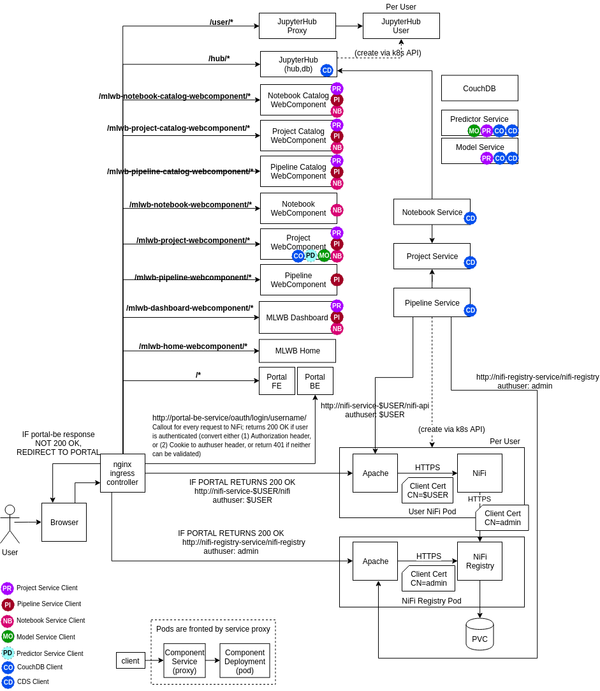
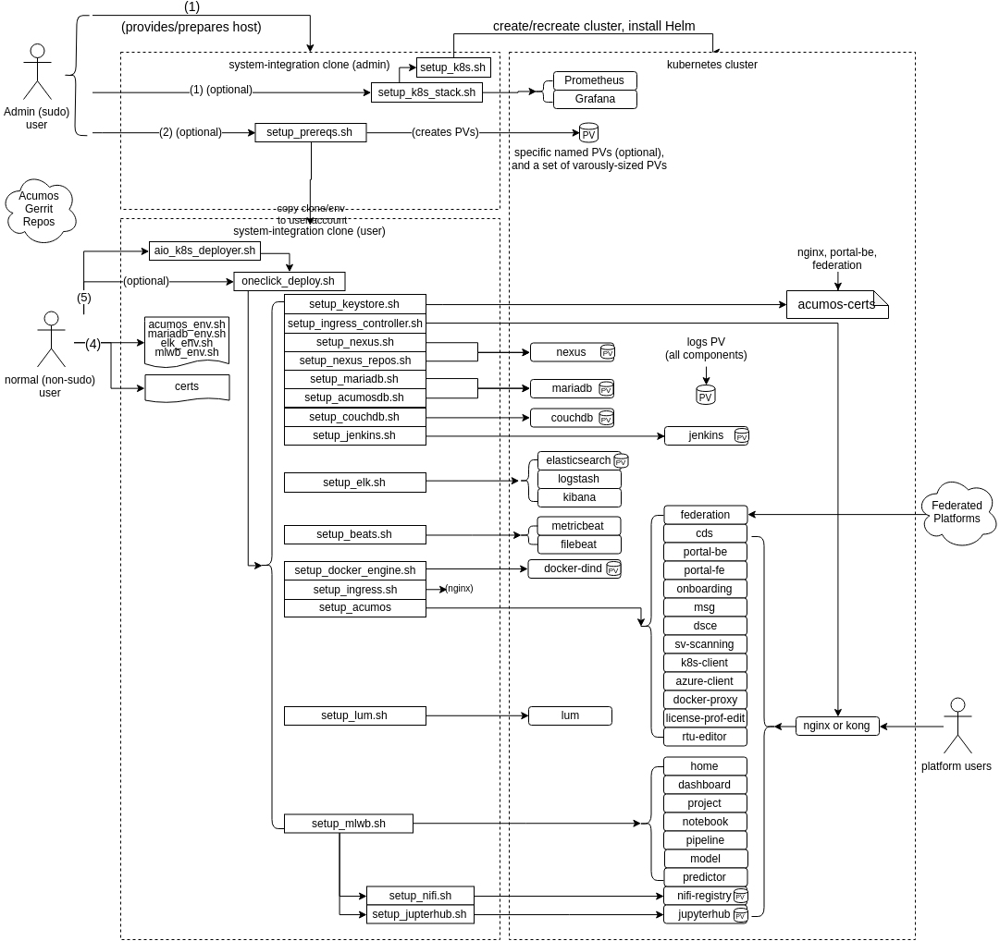

.. ===============LICENSE_START=======================================================
.. Acumos CC-BY-4.0
.. ===================================================================================
.. Copyright (C) 2017-2018 AT&T Intellectual Property & Tech Mahindra. All rights reserved.
.. ===================================================================================
.. This Acumos documentation file is distributed by AT&T and Tech Mahindra
.. under the Creative Commons Attribution 4.0 International License (the "License");
.. you may not use this file except in compliance with the License.
.. You may obtain a copy of the License at
..
.. http://creativecommons.org/licenses/by/4.0
..
.. This file is distributed on an "AS IS" BASIS,
.. See the License for the specific language governing permissions and
.. limitations under the License.
.. ===============LICENSE_END=========================================================

Introduction
============

This user guide describes how to deploy Acumos platforms using the
"One Click deploy" tools designed for those who want a simple and automated way
to deploy an Acumos platform.

What is an AIO deploy?
----------------------

By default, the AIO deploy tools build an all-in-one instance of Acumos, with
all Acumos data and components running under docker or kubernetes (k8s) on a
single virtual machine or physical host machine.

For k8s based deployments, both generic (standard k8s project tools) and
OpenShift (RedHat's k8s distribution) are supported.

Options allow the user to deploy the platform:

* on a cluster of k8s nodes (note: distributing specific components across nodes
  based upon node labels is planned for future releases)
* with a subset of the components
* to use some components that have previously deployed somewhere, e.g. as a
  shared service

The resulting Acumos platform is illustrated in the following two figures, the
first representing the overall architecture, and the second the architecture of
the MLWB (Machine-Learning Workbench) subsystem.

.. image:: images/acumos-architecture-detail-boreas.png
   :width: 100 %

Quickstart Guide to Platform Deployment (TL;DR)
===============================================

NOTICE:

* this process will remove/install software on your host, and configure
  it e.g. firewall and security rules. Only execute this process if you understand
  the implications or are executing the process in a VM/host that you can easily
  re-create.
* by default, the Acumos platform is deployed with service exposure options
  typical for development environments. Production environments and especially
  public environments will need additional planning and restrictions on exposed
  services, that otherwise could expose your host to security risks. See
  `Security Considerations`_ for recommendations on what/how to lock down as
  needed, for exposure of an AIO-based Acumos platform outside development/test
  environments.

Please make sure you review the host prerequisite requirements under
`Host/VM Preparation`_.

See these specific sections based upon how you want to deploy the platform:

* if you have a server/VM or existing k8s cluster upon which you want to install
  the Acumos platform under k8s, using your local workstation to manage the
  platform, see `Deploying from Your Workstation, via the AIO Deployer Tool`_
* if you have a server/VM upon which you want to directly install/manage the
  Acumos platform under k8s, see:

  * `Deploying as a Privileged (sudo) User`_ if you are a sudo user on that
    server/VM, and want to deploy/manage the platform under your own account
  * `Preparation by Host Admin with Platform Deployment by Normal (non-sudo) User`_
    if you are a sudo user on the server/VM, and want to prepare the server/VM
    for another to install/manage the platform upon.

* `Docker Based Deployment`_, if you want to use the legacy docker-compose
  based method of installation. NOTE not all Boreas release features are
  supported under docker-compose.

Kubernetes Based Deployment
---------------------------

The process below will support deployment under either a generic kubernetes
distribution, or the OpenShift kubernetes distribution. The scripts will detect
which distribution is installed and deploy per the requirements of that
distribution.

Deploying from Your Workstation, via the AIO Deployer Tool
..........................................................

This process supports users with the role of either a cluster admin (full rights
to manage cluster resources) or namespace admin (rights to manage resources
under a namespace). It also minimizes any dependencies/customization of the user's
workstation, by use of a docker container built specifically for deploying and
managing the Acumos platform.

A typical use case for this method is a user who will manage the Acumos platform
on the k8s cluster using kubectl executed from their workstation, after basic
prerequisites have been arranged by the cluster admin:

* allocation of a namespace
* allocation of a platform FQDN (with DNS registration), external IP,
  and setup of an ingress controller for the namespace/FQDN
* setup of persistent volume (PV) resources per Acumos requirements (default
  recommended allocations are shown below)

  * logs: 1Gi
  * if deployed as part of the platform, vs use of external instances of these services

    * MariaDB: 10Gi
    * Nexus (Maven repos and docker registry): 10Gi
    * docker-in-docker cache: 5Gi
    * NiFi Registry: 5Gi
    * NiFi users: 5Gi (for each user)
    * JupyterHub: 1Gi
    * Jupyter users: 10Gi (for each user)
    * Elasticsearch: 10Gi

As an option, a user that has cluster admin role can include these prerequisite
steps in the process below.

To use this process, the script aio_k8s_deployer.sh in the tools/aio_k8s_deployer
folder is used, with these prerequisite steps:

* the user has installed, or has access to, a remote k8s cluster (single/multi-node)
* if the k8s cluster does not provide an ingress service with a registered
  DNS name for the platform ingress, the user needs to ensure that the
  external IP address to be used by the ingress controller is registered in DNS
  or configured in the hosts file of their workstation.
* the user has installed a bash shell and docker on their workstation
* the user has copied the aio_k8s_deployer folder contents (e.g. from a
  system-integration repo clone) to their workstation, and cloned/copied the
  system-integration repo into the "deploy" subfolder. For example:

  .. code-block:: bash

    $ mkdir ~/acumos
    $ git clone "https://gerrit.acumos.org/r/system-integration"
    $ cp -r system-integration/tools/aio_k8s_deployer/* ~/acumos/.
    $ cp -r system-integration ~/acumos/deploy/.
  ..

    * the deploy subfolder will be later mapped into the root folder of the
      acumos-deploy docker container image by the aio_k8s_deployer.sh script.

  * the aio_k8s_deployer.sh script and the files in the deploy subfolder have been
    customized as desired, including these files in the "deploy" subfolder

    * k8s configuration file "kube-config"; this will be used in the
      container, to access the cluster via kubectl
    * (optional) an environment customization script "customize_env.sh",
      based upon the sample script customize_env.sh, to override the
      default environment variables for Acumos, MLWB, MariaDB, and ELK
    * (optional) updated the Dockerfile, as desired
    * (optional) a post-deploy script, which can include any actions the user
      wants to automatically occur after the platform is installed, e.g.
      creation of user accounts, model onboarding; by default the
      aio_k8s_deployer.sh script will invoke a script named 'post_deploy.sh'
      if present in the deploy subfolder.

To prepare the k8s environment and install using the aio_k8s_deployer:

* using bash, the user runs the following command to create the "acumos-deploy"
  docker image

.. code-block:: bash

  $ bash aio_k8s_deployer.sh build
..

* if the user has a cluster admin role, the user runs the following command
  to setup typical prerequisites on the k8s master, e.g.

  * apply the environment customizations in customize_env.sh
  * cleans the ~/system-integration folder on the sudo user's account
  * copies just the needed system-integration folders to that account
  * executes the setup_prereqs.sh script, and saves a log on the local host
  * copies the updated system-integration folders/env back to the local host

.. code-block:: bash

  $ bash aio_k8s_deployer.sh prep <host> <user>
..

  * where:

    * <host>: hostname of the k8s master node to execute the steps on
    * <user>: sudo user on the k8s master node

* the user then runs the following command to deploy the platform, which

  * starts the acumos-deployer container
  * updates the AIO tools environment to run under the container
  * executes oneclick_deploy.sh, and saves a log
  * executes the post_deploy.sh script, if present
  * copies the updated files from the acumos-deployer container to the user's
    workstation deploy subfolder, incuding the log files and all updated files
    under the system-integration repo

.. code-block:: bash

  $ bash aio_k8s_deployer.sh deploy <host> [add-host]
..

  * where:

    * <host>: name to suffix to the docker container, to identify the
      customized container for use with a specific deployment instance
    * [add-host]: (optional) value to pass to docker as add-host option

* See `When Deployment is Complete`_ for further steps

Deploying as a Privileged (sudo) User
.....................................

This process is for a user that wants to execute all steps in the deployment
process using their host account. To deploy the Acumos platform with the default
options, as a user on a linux host with at least 16GB RAM and admin (sudo)
permission, follow the process below.

* clone the system-integration repo

  .. code-block:: bash

    $ git clone https://gerrit.acumos.org/r/system-integration
  ..

* using bash, check if the user is part of the docker group, and add if not

  .. code-block:: bash

    $ if [[ "$(id -nG "$USER" | grep docker)" == "" ]]; then sudo usermod -aG docker $USER; fi
  ..

  * if you see "usermod: group 'docker' does not exist", install docker (e.g.
    using setup_docker.sh in the system-integration/tools folder) and run the
    command above again. Once you do not see the message above, logout and re-login.

* if you don't have an existing k8s cluster, run the following command to setup
  a cluster.

  .. code-block:: bash

    $ bash system-integration/tools/setup_k8s_stack.sh setup
  ..

* execute the following command to install/configure prerequisites, including
  k8s, MariaDB, and the ELK stack, using your user account, and the hostname or
  domain name you will use to access the deployed platform.

  .. code-block:: bash

    $ bash system-integration/AIO/setup_prereqs.sh k8s <domain> $USER <generic|openshift> 2>&1 | tee aio_prep.log
  ..

* When you see "Prerequisites setup is complete." as the result of the
  command above, execute the following commands to complete platform setup

  .. code-block:: bash

    $ cd system-integration/AIO
    $ bash oneclick_deploy.sh 2>&1 | tee aio_deploy.log
  ..

* The commands above include saving of the detailed deployment actions to a
  log file 'deploy.txt'. This can be helpful in getting support from the
  Acumos project team, to overcome issues you might encounter. If you don't
  want to save the log, just leave out the part of the commands above that
  starts with the 'pipe' ('|').

* As described above, if you don't need to save the deploy logs, leave out the
  the part of the commands above that starts with the 'pipe' ('|').

* See `When Deployment is Complete`_ for further steps

Preparation by Host Admin with Platform Deployment by Normal (non-sudo) User
............................................................................

This process is for a host Admin (sudo user) to prepare the host for a normal
(non-sudo) user that will complete the platform deployment, under their account
on the host.

* Admin completes steps in the previous section, through setup of a k8s cluster

* Admin executes the following command to install/configure prerequisites,
  including k8s, MariaDB, and the ELK stack, using their account. <user> in this
  case is the username of the normal user that will complete the deployment.

  .. code-block:: bash

    $ bash system-integration/AIO/setup_prereqs.sh k8s <domain> $USER <generic|openshift> 2>&1 | tee aio_prep.log
  ..

  * When prerequisites setup is complete, the resulting environment files and
    system-integration clone will have been copied to the user account.

* The user executes the following commands to complete platform setup

  .. code-block:: bash

    $ cd system-integration/AIO
    $ bash oneclick_deploy.sh 2>&1 | tee aio_deploy.log
  ..

* As described above, if you don't need to save the deploy logs, leave out the
  the part of the commands above that starts with the 'pipe' ('|').

* See `When Deployment is Complete`_ for further steps

Docker Based Deployment
-----------------------

NOTE: Not all Acumos features will work as expected under docker, so those will
not be deployed. Examples include the new services in support of model training.

To deploy the components that do work under docker, follow the instructions in
the sections below.

Prerequisites for Docker Based Deployment
.........................................

Prerequisites for docker based deployment:

* Deployment is supported only on Ubuntu Xenial (16.04), Bionic (18.04), or
  Centos 7 hosts
* All hostnames or FQDNs specified in environment files must be DNS-resolvable
  (entries in /etc/hosts or in an actual DNS server)
* User running this script

  * has sudo privileges
  * has installed docker per system-integration/tools/setup_docker.sh
  * has added themselves to the docker group (sudo usermod -aG docker $USER),
    and re-logged-in to activate docker group membership
  * if deploying in preparation for use by a non-sudo user, has created the
    user account (sudo useradd -m <user>)
  * has cloned or otherwise provided the system-integration repo, in the
    user's home folder
  * has customized or created as needed

    * the main environment file system-integration/AIO/acumos-env
    * ELK-stack environment: see
      system-integration/charts/elk-stack/setup_elk_env.sh as a guide to what
      environment values can be customized. Customize the default values in
      that script, by changing the values after ':-" e.g. to change "true" to
      "false" replace the first line below with the second

      * export ACUMOS_DEPLOY_METRICBEAT="${ACUMOS_DEPLOY_METRICBEAT:-true}"
      * export ACUMOS_DEPLOY_METRICBEAT="${ACUMOS_DEPLOY_METRICBEAT:-false}"

    * MariaDB: as for the ELK_stack, customize
      system-integration/charts/mariadb/setup_mariadb_env.sh

Deploying for Yourself, as a Host Admin (sudo user)
...................................................

NOTE: If you are deploying into an Azure-based VM, pay attention to this
special configuration need for the docker-engine; update the acumos_env.sh
(in system-integration/AIO) script to set the ACUMOS_DEPLOY_DOCKER_DIND flag to
"false", which will ensure that the docker-dind service is not installed.
Docker-dind has known issues under Azure.

  .. code-block:: bash

    export ACUMOS_DEPLOY_DOCKER_DIND=false
  ..

If deploying the platform for yourself, run these commands:

  .. code-block:: bash

    cd system-integration/AIO/
    bash setup_prereqs.sh docker <domain> $USER 2>&1 | tee aio_deploy.log
    bash oneclick_deploy.sh 2>&1 | tee -a aio_deploy.log
  ..

  * where:

    * <domain> is the name you want to use for the Acumos portal. This can be a
      hostname or FQDN.

* See `When Deployment is Complete`_ for further steps

Preparing as a Host Admin, with Platform Deployment as a Normal User
....................................................................

If a Host Admin needs to run the privileged-user steps for a normal user that
will take it from there:

* NOTE: If you are deploying into an Azure-based VM, pay attention to this
  special configuration need for the docker-engine; update the acumos_env.sh
  (in system-integration/AIO) script to set the ACUMOS_DEPLOY_DOCKER_DIND flag to
  "false", which will ensure that the docker-dind service is not installed.
  Docker-dind has known issues under Azure.

  .. code-block:: bash

    export ACUMOS_DEPLOY_DOCKER_DIND=false
  ..

* As the Host Admin, run these commands:

  .. code-block:: bash

    cd system-integration/AIO/
    bash setup_prereqs.sh docker <domain> <user> 2>&1 | tee aio_deploy.log
  ..

  * where:

    * <domain> is the name you want to use for the Acumos portal. This can be a
      hostname or FQDN.
    * <user> use the normal user's account name on the host

* As the normal user, run this command

  .. code-block:: bash

    bash oneclick_deploy.sh 2>&1 | tee -a aio_deploy.log
  ..

* As described above, if you don't need to save the deploy logs, leave out the
  the part of the commands above that starts with the 'pipe' ('|').

When Deployment is Complete
...........................

When deployment has completed, you should see a success message with a set of
URLs to access the various platform services. You can also view the file
"acumos.url" which will be in the system-integration/AIO folder (example below)

.. code-block:: bash

   You can access the Acumos portal and other services at the URLs below,
   assuming hostname "acumos.example.com" is resolvable from your workstation:

   Portal: https://acumos.example.com
   Common Data Service Swagger UI: https://acumos.example.com/ccds/swagger-ui.html
   - if you have issues with using the CDS swagger over HTTPS, try the HTTP link
     http://$ACUMOS_DOMAIN:$ACUMOS_CDS_NODEPORT/ccds/swagger-ui.htm
   Portal Swagger UI: https://acumos.example.com/api/swagger-ui.html
   Onboarding Service Swagger UI: https://acumos.example.com/onboarding-app/swagger-ui.html
   Kibana: http://acumos.example.com:30561/app/kibana
   Nexus: http://acumos.example.com:30881

By default, the platform is not configured to require email confirmation of
new accounts, so you can create a new account directly on the Portal home. To
create an account with the Admin role (needed for various platform admin
functions), use the create_user.sh script in the system-integration/tests folder

Release Scope
=============

Current Release (Boreas)
------------------------

The `Acumos wiki <https://wiki.acumos.org/display/OAM/System+Integration>`_
describes the principle goals and related deployment scenarios supported by the
AIO toolset, and regularly verified in testing.

What's included in the AIO tools
................................

In system-integration repo folder AIO:

* setup_prereqs.sh: Script to be used by a host admin (a user with privilege
  to install applications and configure the host) to prepare a host for a normal
  user to later deploy/manage the Acumos platform there. Typically used for
  lab environments.
* oneclick_deploy.sh: the main script that kicks off the deployment, to setup
  an AIO instance of Acumos under a docker or kubernetes environment.
* acumos_env.sh: environment setup script that is customized as new
  environment parameters get generated (e.g. passwords). Used by various
  scripts in this toolset, to set shell environment variables that they need.
* setup_acumosdb.sh: script that initializes the Acumos database under MariaDB.
* setup_keystore.sh: script that enables use of pre-configured CA and server
  certificates for an Acumos platform, or creation of new self-signed
  certificates.
* docker_compose.sh: Script called by the other scripts as needed, to take
  actions on the set of Acumos docker services. Used by oneclick_deploy.sh and
  clean.sh for docker-based deployments. You can also call this directly e.g.
  to tail the service container logs. See the script for details.
* utils.sh: utility script containing functions used by many of these scripts.
* redeploy_component.sh: Script that allows the redeployment of a single
  component.
* clean.sh: if needed, this script allows a privileged user to remove all
  components and dependencies of the Acumos platform installed by the tools
  above.

In AIO/beats:

* deployment scripts and templates for the Filebeat and Metricbeat services
  as ELK stack components deployed along with the Acumos platform.

In AIO/certs:

* setup_certs.sh: creates self-signed certificates (CA and server), keystore,
  and truststore for use by core platform components.

In AIO/docker/acumos:

* docker-compose yaml files and deployment script for Acumos core components.

In AIO/certs:

* setup_certs.sh: script to create self-signed CA and server certs.
* This folder is also used to stage user-provided certs to be used in Acumos
  platform deployment.

In AIO/docker-engine:

* scripts and templates to deploy docker-in-docker as the docker-engine service
  for k8s-based Acumos platforms, or the docker-engine service on the AIO host

In AIO/docker-proxy:

* scripts and templates for deployment of the docker-proxy core component of the
  Acumos platform

In AIO/elk-stack:

* scripts and templates to deploy the ELK stack core components under docker

In AIO/ingress:

* scripts and templates to deploy the
  `NGINX Ingress Controller for Kubernetes <https://github.com/kubernetes/ingress-nginx>`_,
  and ingress rules for Acumos core components.

In AIO/kong:

* scripts and templates to deploy the Kong service as an ingress controller for
  the Acumos platform, as deployed under docker

In AIO/kubernetes:

* under deployment, kubernetes deployment templates for all system components
* under service, kubernetes service templates for all system components
* under configmap, kubernetes configmap templates for all system components
* under rbac, kubernetes role-based access control templates enabling system
  components to invoke kubernetes cluster operations

In AIO/mariadb:

* scripts and templates to deploy the MariaDB under docker, as the Acumos
  platform database backend service

In AIO/nexus:

* scripts and templates to deploy the Nexus service for the Acumos platform

In charts:

* scripts and templates to deploy the following components for k8s-based
  deployments, using Helm as deployment tool

  * elk-stack: ELK stack core components
  * jupyterhub: the JupterHub/JupyterLab services for notebook-based model
    development
  * mariadb: MariaDB service
  * nifi: the NiFi service for data pipeline development
  * zeppelin: the Zeppelin service for notebook-based model development

    * NOTE: Zeppelin deployment is a single, multi-user instance which is
      provided for experimental use in Boreas. Single-user instance deployment
      is coming in the next release (Clio).

In tests:

* peer_test.sh: Peering and marketplace subsciptions setup for two AIO platforms.
  Used to test federation use cases.
* create_peer.sh: Automated setup of a peer relationship between two Acumos
  AIO deployments. Used by peer_test.sh.
* create_user.sh: Automated user provisioning and role assignment. Used by
  scripts in this repo to create default admin accounts. Can also be used to
  create user accounts for testing or platform use.
* create_subscription.sh: creates a federation subscription for all models
  published by a federated Acumos platform.
* bootstrap_models.sh: Model package onboarding via curl, for all models in
  a folder.
* onboard_model.sh: Model package onboarding via curl.
* license_scan.sh: invokes a license scan for a solution, using the Security
  Verification Scanning Service.

In tools:

  * aio_k8s_deployer: deployment script and configuration to deploy Acumos
    under k8s using a docker container based approach, which minimizes
    dependencies on the user workstation
  * add_host_alias.sh: adds a host alias to an Acumos core component, e.g.
    for hostnames/FQDNs that are not resolvable through DNS.
  * setup_docker.sh: deploys the docker version used for docker-based
    platform deployment and interaction.
  * setup_helm.sh: deploys Helm as a service deployment tool.
  * setup_k8s.sh: deploys a generic k8s cluster.
  * setup_kubectl.sh: deploys and uses the kubectl tool used by other scripts and
    the user to manage and interact with generic k8s based deployments.
  * setup_mariadb_client.sh: deploys the MariaDB client as used by other
    scripts to configure the Acumos database.
  * setup_openshift.sh: deploys an OpenShift Origin 3.11 kubernetes cluster, for
    subsequent Acumos platform deploymet on Centos 7 servers.
  * setup_openshift_client.sh: deploys the OpenShift client (oc) tool
    used by other scripts and users to manage and interact with OpenShift based
    platform deployments.
  * setup_prometheus.sh: deploys the Prometheus monitoring service, with
    Grafana as a data visualization tool, for monitoring the Acumos platform's
    resources at the k8s level. Also deploys Grafana dashboards in the dashboards
    folder.
  * setup_pv.sh: deploys host-based persistent volumes for use with
    docker and k8s-based platform deployments.

Deployment Step-by-Step Guide
=============================

The steps in this process are illustrated by the following figure. Note this
figure refers to kubernetes, but the same basic process applies for docker.

Prerequisites for each step are described for the step, under
`Pre-Arrangement of Ingress Certs`_, `Install Host Preparation by Admin`_, and
`Platform Deployment`_.

1) Host Admin clones the system-integration repo, or uses a local/customized
   clone.
2) Host Admin customizes the environment files and/or certs as desired, per
   `Pre-Arrangement of Ingress Certs`_
3) The Admin runs the applicable host preparation script(s) as described in
   `Install Host Preparation by Admin`_
4) The user (Admin, if installing for their self) further updates the
   environment files and certs as desired, per `Platform Deployment`_
5) The user deploys the rest of the platform components via script
   'oneclick_deploy.sh', per `Platform Deployment`_

Host/VM Preparation
-------------------

For developer-focused AIO deployments, it's assumed that the developer has a
minimum of one host machine (physical workstation/server or VM) that they will
use for the platform.

The AIO platform is also deployable on a cluster of machines or in a multi-node
kubernetes cluster, but note:

* for docker-based deployment, the AIO toolset supports limited distribution of
  components across nodes, primarily the backend services (Nexus, MariaDB, ELK,
  ...), in addition to the core platform components in one node
* for kubernetes-based deployment, the components will be distributed across
  nodes in a kubernetes cluster per the default scheduling configuration of the
  cluster

Following are basic requirements for single-node/AIO machines:

* minimum 16 GB RAM (32 GB or more recommended)
* minimum 2 core/vCore (4 or more recommended)
* minimum 1 network interface
* network security rules in place to allow incoming traffic on the following ports:

.. csv-table::
    :header: "Port(s)", "Purpose"
    :widths: 20, 80
    :align: left

    "22", "SSH into the VM"
    "80", "Ingress controller (Kong)"
    "443", "Ingress controller (http)"
    "443", "Ingress controller (https)"
    "6443", "kubernetes API",
    "30000-32767", "direct service access, e.g. k8s nodeports"
..

Pre-Arrangement of Ingress Certs
--------------------------------

If you deploy the AIO platform often or in multiple test environments, you may
find it useful to pre-arrange the ingress certs that will be used to access the
platform(s), either using commercial cert providers, or the self-signed cert
tools provided in the system-integration repo. This allows you and users for
example to use web browser tools to trust self-signed certs, avoiding browser
warnings.

Creating a Self-Signed Cert
+++++++++++++++++++++++++++

The Acumos tool supporting creation of self-signed certs is in
system-integration/AIO/certs/setup_certs.sh. An example is given below, showing
how to select the parameters for setting up a cert and related files that are
usable on multiple hosts, by hostname/domain and IP address:

* This script is invoked as:

.. code-block:: bash

  bash setup_certs.sh <name> <subject-name> ["alt-names"] ["alt-ips"]
..

Where:

* name: name prefix to use in the generated files (e.g. acumos)
* subject-name: primary domain name to associate
* alt-names: quoted, space-delimited set of alternate names
* alt-ips: quoted, space-delimited set of alternate IP addresses

as in the example:

.. code-block:: bash

  cd system-integration/AIO/certs
  bash setup-certs.sh acumos acumos \
    "test01 test02 test03 acumos-test04.eastus.cloudapp.azure.com" \
    "10.1.0.2 10.1.0.3 10.1.0.4 10.1.0.5"
..

This will generate the following files:

* acumos-ca.key: self-signed CA private key
* acumos-ca.crt: self-signed CA certificate
* acumos.key: server cert private key
* acumos.crt: server cert
* acumos-keystore.p12: PKCS12 format keystore with server cert
* acumos-truststore.jks: JKS format truststore with CA cert
* cert_env.sh: environment file with the related passwords

Using Commercial Certs
++++++++++++++++++++++

NOTE: the process below has not been verified. If you need to following this
process and encounter issues, reach out to the
`Acumos Community mail list <https://lists.lfai.foundation/g/acumosai-community>`_
for help.

To use commercial certs with the Acumos AIO platform, follow these steps:

* place the server cert and private key in folder system-integration/AIO/certs
* update related values in system-integration/AIO/acumos_env.sh and put these
  commands into a file system-integration/AIO/cert_env.sh

  * export ACUMOS_CERT_PREFIX=<prefix you want to use for your keystore/truststore
  * export ACUMOS_CERT=<name of the server cert file)
  * export ACUMOS_CERT_KEY=<name of the server cert private key file>
  * export ACUMOS_CERT_KEY_PASSWORD=<passphrase for the cert private key>

* run the commands below, which create the keystore and truststore for Acumos

  .. code-block:: bash

    cd system-integration/AIO/certs
    source cert_env.sh
    KEYSTORE_PASSWORD=$(uuidgen)
    echo "export KEYSTORE_PASSWORD=$KEYSTORE_PASSWORD" >>cert_env.sh
    openssl pkcs12 -export \
      -in $ACUMOS_CERT \
      -inkey $ACUMOS_CERT_KEY \
      -passin pass:$CERT_KEY_PASSWORD \
      -certfile $ACUMOS_CERT \
      -out $ACUMOS_CERT_PREFIX-keystore.p12 \
      -passout pass:$KEYSTORE_PASSWORD

    TRUSTSTORE_PASSWORD=$(uuidgen)
    echo "export TRUSTSTORE_PASSWORD=$TRUSTSTORE_PASSWORD" >>cert_env.sh
    keytool -import \
      -file $ACUMOS_CERT \
      -alias $ACUMOS_CERT_PREFIX-ca \
      -keystore $ACUMOS_CERT_PREFIX-truststore.jks \
      -storepass $TRUSTSTORE_PASSWORD -noprompt

  ..

Install Host Preparation by Admin
---------------------------------

NOTE: If you are deploying under k8s into an Azure-based VM, pay attention to the
special configuration need for the docker-engine, as described below.

Prerequisites:

* Ubuntu Xenial/Bionic or Centos 7 server
* All hostnames specified in acumos_env.sh must be DNS-resolvable on all hosts
  (entries in /etc/hosts or in an actual DNS server)
* For deployments behind proxies, set ACUMOS_HTTP_PROXY and ACUMOS_HTTPS_PROXY in acumos_env.sh
* Admin user running this script has:

  * Installed docker per system-integration/tools/setup_docker.sh
  * Added themselves to the docker group (sudo usermod -aG docker $USER)
  * Logged out and back in, to activate docker group membership

* Initial basic setup (manual)

  * If you are an Admin and deploying the platform for a normal user, assuming
    the non-sudo user is "acumos"

    .. code-block:: bash

      sudo useradd -m acumos
    ..

This process prepares the host with prerequisites that normal users do not have
permission to arrange. This includes:

* installing software packages
* configuring host settings
* creating folders for host-mapped volumes

The Admin user will follow this process:

* 'install root folder' refers to the Admin user's home folder. Installation
  in other root folders is a work in progress, and not yet fully verified.
* create in the install root folder a subfolder "acumos" and folders "env",
  "logs", "certs" under it.
* in the install root folder, clone the system-integration repo (branch, tag,
  commit, or master), and make any desired updates to it (e.g. checkout a
  specific patch)
* If you are deploying the platform under k8s in an Azure VM, update acumos_env.sh
  (in system-integration/AIO) script to set the ACUMOS_DEPLOY_DOCKER_DIND flag to
  "false", which will ensure that the docker-dind service is not installed.
  Docker-dind has known issues under Azure.

  .. code-block:: bash

    export ACUMOS_DEPLOY_DOCKER_DIND=false
  ..

* If you are deploying under docker, run the command

.. code-block:: bash

  bash setup_prereqs.sh <under> <domain> <user>
..

  * under: docker (install prereqs for docker or k8s based deployment)
  * domain: FQDN of platform
  * user: user that will be completing Acumos platform setup via
          oneclick_deploy.sh (if installing for yourself, use $USER)

* If you are deploying under k8s, and do not have an existing k8s cluster or
  need to deploy a new cluster e.g. an AIO cluster on a VM, run the command
  below on the host for the new cluster

  .. code-block:: bash

    bash system-integration/tools/setup_k8s_stack.sh setup
  ..

* If you are deploying under k8s, run the command

  .. code-block:: bash

    bash system-integration/AIO/setup_prereqs.sh k8s <domain> $USER <generic|openshift>
  ..

  * k8s: indicates deployment under k8s
  * user: non-sudo user account (use $USER if deploying for yourself)
  * domain: domain name of Acumos platorm (resolves to this host)
  * generic|openshift: use generic k8s or openshift

When the process is complete, the updated system-integration clone and environment
will have been copied to the platform deployment user's home folder. If you are
deploying the platform for yourself, proceed to the next section. If preparing
the platform for a normal user, the user should execute the process in the next
section.

Platform Deployment
-------------------

The script supporting this step is system-integration/AIO/oneclick_deploy.sh.

Prerequisites:

* User workstation is Ubuntu Xenial/Bionic, Centos 7, or MacOS
* setup_prereqs.sh run by a sudo user
* As setup by those scripts, a user home folder "acumos" with subfolders "env",
  "logs", and "certs". These folders are created by the prerequisites scripts
  principally as a backup to the environment files under system-integration/AIO.

This process deploys the Acumos platform with the options selectable by the
user, e.g.

* any option selectable through the environment files, which can be customized
  in the backup folder "acumos/env" or directly in the system-integration clone
  under:

  * ~/system-integration/AIO/acumos/env/acumos_env.sh
  * ~/system-integration/AIO/acumos/env/mariadb_env.sh
  * ~/system-integration/AIO/acumos/env/elk_env.sh
  * ~/system-integration/AIO/mlwb/mlwb_env.sh
  * NOTE

    * a detailed description of the customizable environment values is not
      provided here, but the Acumos community can assist you with any support
      questions you may have via the
      `Acumos Community mail list <https://lists.lfai.foundation/g/acumosai-community>`_

* use of pre-created certs per `Pre-Arrangement of Ingress Certs`_

* if you updated the environment files or certificates under ~/acumos, prior
  to running the deployment command below, copy those updates into the
  system-integration clone:

  * cp ~/acumos/env/* ~/system-integration/AIO/.
  * cp ~/acumos/certs/* ~/system-integration/AIO/certs/.

To deploy the rest of the platform components, run the commands:

  .. code-block:: bash

    cd ~/system-integration/AIO
    bash oneclick_deploy.sh
  ..

When the process is complete, you will see a set of URLs to the main platform
component/UI features, as described above.

Updating Configuration and Components
-------------------------------------

Changes to the configuration can be applied as described in the previous section.
Note that if you are making changes to the configuration of a deployed platform,
some changes may break some aspects of the platform, so be careful.

The most commonly updated configuration items include:

* in acumos_env.sh

  * component versions
  * component hosts and ports, e.g. for reuse of previously deployed components,
    e.g. a shared docker-engine, docker registry, MariaDB, Nexus, or ELK stack service
  * component credentials (user and/or password)
  * ports, to avoid conflict with other deployments in the same environment
  * Nexus repo details
  * HTTP proxy
  * CDS (Common Dataservice) database version
  * model onboarding tokenmode
  * operator ID
  * kubernetes namespace
  * Persistent Volume options

* docker-compose templates in AIO/docker/acumos or kubernetes templates in
  AIO/kubernetes

  * Note: make sure the template modifications are compatible with previously
    deployed components, and the version of the related Acumos component you
    are deploying/re-deploying

Stopping, Restarting, Redeploying
---------------------------------

Note: the following sections assume that you have deployed the Acumos platform
from the system-integration folder in your user home directory, i.e. "~/".

Redeploying With Current Database
+++++++++++++++++++++++++++++++++

If you just want to redeploy Acumos components, without affecting any data in the
MariaDB or Nexus, be sure to set these variables in AIO/acumos_env.sh:

.. code-block:: bash

  export ACUMOS_DEPLOY_MARIADB=false
  export ACUMOS_SETUP_DB=false
  export ACUMOS_DEPLOY_NEXUS=false
..

Docker-Based Deployments
++++++++++++++++++++++++

To stop components running under docker and remove the containers, execute the
following commands from the "docker" folder related to the type of component,
referencing the related docker-compose yaml file as "<yml>":

.. code-block:: bash

  cd ~/system-integration/<docker folder>
  source ~/system-integration/AIO/acumos_env.sh
  docker-compose -f acumos/<yml> down
..

The related docker folders are:

* AIO/docker, for Acumos core components azure-client, common-data-svc,
  dsce (AcuCompose), federation, kubernetes-client, microservice-generation,
  onboarding, portal-be, portal-fe, sv-scanning
* AIO/docker-proxy/docker, for the docker-proxy core component
* AIO/mlwb/docker, for the MLWB components
* AIO/nexus/docker, for nexus
* AIO/mariadb/docker, for mariadb
* AIO/kong/docker, for kong
* AIO/elk-stack/docker, for the core ELK-stack components elasticsearch,
  logstash, kibana
* AIO/beats/docker, for the "beats" components filebeat, metricbeat

To restart these components, e.g. after updating the related configuration files,
issue the following command:

.. code-block:: bash

  cd ~/system-integration/<docker folder>
  source ~/system-integration/AIO/acumos_env.sh
  docker-compose -f acumos/<yml> up -d --build
..

If you want to automatically stop and redeploy the components in one command:

* for Acumos core components (azure-client-service, cds-service, dsce-service,
  federation-service, kubernetes-client-service, msg-service, onboarding-service,
  portal-be-service, portal-fe-service, sv-scanning-service)

  .. code-block:: bash

    bash ~/system-integration/AIO/redeploy_component.sh <component>
  ..

* for the other components, a specific redeployment script is provided in the
  related folder (docker-proxy, mlwb, nexus, mariadb, kong, elk-stack, beats)

  .. code-block:: bash

    bash ~/system-integration/AIO/<folder>/setup_*.sh  ~/system-integration/AIO/
  ..

Kubernetes-Based Deployments
++++++++++++++++++++++++++++

Because kubernetes-based components may depend upon a variety of other
kubernetes resources specific to them or shared with other components (e.g.
configmaps, secrets, PVCs), simply redeploying the specific
components after any required configuration updates is recommended.

The configuration files specific the components are generally under a subfolder
"kubernetes", and are specific to the type of resource (e.g. service, deployment,
configmap, secret, PVC, etc). Once you have updated these as needed, you can'
redeploy the component and any resources specific to it (not shared) via the
command:

* for core components under AIO/kubernetes/deployment, using the component names
  per the "app:" value in the related deployment template (azure-client, cds,
  dsce, federation, kubernetes-client, msg, onboarding, portal-be, portal-fe,
  sv-scanning):

  .. code-block:: bash

    bash ~/system-integration/AIO/redeploy_component.sh <component>
  ..

* for the other components, running the related "setup_*.sh" command as described
  for docker

If you just need to stop a component, use the following command and reference the
related "app" label:

.. code-block:: bash

  kubectl delete deployment -n acumos -l app=<app>
..

You can see all the component-related "app" labels via the command:

.. code-block:: bash

  kubectl get deployment -n acumos -o wide
..

After stopping the component, you can redeploy it as needed using the methods
described above.

Logs Location
=============

Logs are easily accessible on the AIO host under /mnt/<ACUMOS_NAMESPACE>/logs
directory ('<ACUMOS_NAMESPACE>' is by default 'acumos'). That directory is
mounted by most Acumos components as their log directory.

Security Considerations
=======================

As noted in `Introduction`_, the AIO deployment approach includes various
development/test environment-enabling aspects, that for a more "production" or
publicly-exposed deployment, should be reconsidered and as needed, locked down.

For k8s-based platforms, some of these aspects are related to work-in-progress
on more fully supporting platform exposure through ingress controllers. An
ingress controller is a convenient place to apply subnet-based restrictions on
service access. See the
`NGINX ingress annotations guide for whitelist-source-range <https://kubernetes.github.io/ingress-nginx/user-guide/nginx-configuration/annotations/#whitelist-source-range>`_
for more information. Following are the services exposed in the Acumos platform
that can be access-controlled using a whitelist-source-range source annotation,
by updating the related ingress template:

.. csv-table::
    :header: "Service", "Recommendation", "Ingress template"
    :widths: 30, 30, 40
    :align: left

    "CDS (Common Data Service)", "Admin access only", "AIO/ingress/templates/cds-ingress.yaml"
    "NiFi Registry", "Admin access only", "AIO/mlwb/nifi/kubernetes/ingress-registry.yaml"
    "NiFi User", "User access (required)", "AIO/mlwb/nifi/templates/ingress.yaml"
    "JupyterHub (Hub and User)", "User access (required)", "See note below"
    "Kubernetes client", "User access (required)", "AIO/ingress/templates/k8s-client-ingress.yaml"
    "Onboarding", "User access (required)", "AIO/ingress/templates/onboarding-ingress.yaml"
    "Portal", "User access (required)", "AIO/ingress/templates/portal-ingress.yaml"
    "MLWB Dashboard", "User access (required)", "AIO/mlwb/kubernetes/mlwb-dashboard-webcomponent-ingress.yaml"
    "MLWB Home", "User access (required)", "AIO/mlwb/kubernetes/mlwb-home-webcomponent-ingress.yaml"
    "MLWB Notebook", "User access (required)", "AIO/mlwb/kubernetes/mlwb-notebook-webcomponent-ingress.yaml"
    "MLWB Notebook Catalog", "User access (required)", "AIO/mlwb/kubernetes/mlwb-notebook-catalog-webcomponent-ingress.yaml"
    "MLWB Pipeline", "User access (required)", "AIO/mlwb/kubernetes/mlwb-pipeline-webcomponent-ingress.yaml"
    "MLWB Pipeline Catalog", "User access (required)", "AIO/mlwb/kubernetes/mlwb-pipeline-catalog-webcomponent-ingress.yaml"
    "MLWB Project", "User access (required)", "AIO/mlwb/kubernetes/mlwb-project-webcomponent-ingress.yaml"
    "MLWB Project Catalog", "User access (required)", "AIO/mlwb/kubernetes/mlwb-project-catalog-webcomponent-ingress.yaml"
..

Notes on the table above:

* JupyterHub ingress rules are currently created by the deployment script
  in charts/jupyterhub/setup_jupyterhub.sh.

For other components, k8s nodeports are currently used for primary access or
supplementatl access. Note that if possible, these services will be migrated to
access via the ingress controller, early in the next release. However, in many
cases these services may be provided as shared application services, and
deployed outside the Acumos platform. The AIO toolset supports that as an option,
which eliminates any concern about exposing these services as part of an Acumos
platform:

.. csv-table::
    :header: "Service", "NodePort (default)", "Rational for NodePort Use", "Security Recommendation"
    :widths: 20, 10, 30, 40
    :align: left

    "CDS (Common Data Service)", "30800", "Alternative swagger UI (see note)", "Apply firewall rule if needed"
    "Docker Proxy", "30883", "Ingress rule is WIP (see note)", "Leave open (required)"
    "Federation (peer access)", "30984", "Ingress rule is WIP (see note)", "Leave open (required)"
    "Federation (local access)", "30985", "Ingress rule is WIP (see note)", "Leave open (required)"
    "Nexus (Maven)", "30881", "Admin access to Nexus UI (see note)", "Apply firewall rule if needed, or use external service"
    "Nexus (Docker)", "30882", "Admin access to Nexus Docker Registry (see note)", "Apply firewall rule if needed, or use external service"
    "JupyterHub", "(dynamic ports)", "Access to the Jupyter proxy (see note)", "Apply firewall rule if needed"
    "Security Verification (SV) Scanning Service", "30982", "Admin access to the SV service (see note)", "Apply firewall rule if needed"
..

Notes on the table above:

* The CDS NodePort addresses current issues (under investigation) with access to
  the CDS swagger UI via HTTPS thru the ingress controller
* The Docker Proxy NodePort is currently required because an ingress rule for
  it has not been implemented/tested. An update will be published as soon as this
  has been done.
* Ingress support fort Federation NodePort is a WIP, like Docker Proxy. Use of a
  context path is hypothetically possible since peer configuration allows the
  use of a context path when defining the peer API endpoint; this just needs to
  be implemented/tested, and documented.  An update will be published as soon as
  this has been done.
* Configuraton of JupyterHub to avoid NodePort use is a WIP.
* Access to the Security Verification Scan API is provided so that Admins can
  invoke scans manually or through external systems, and also for the future
  support of external scan result notifications.

Known Issues
============

Following are some things to watch out for in the process of deploying the
Acumos platform with the AIO toolset. Solutions to improve the reliability of
platform deployment are being implemented with each release, but this is a
work-in-progress, and given that the Acumos platform deployment depends upon
a number of upstream projects/components, issues such as the below may be
encountered. This list will be updated as needed after the final Boreas release
user guide is published, and will be available on the Acumos wiki at
`Hints and Known Issues <https://wiki.acumos.org/display/OAM/Hints+and+Known+Issues>`_

MariaDB Mirror Reliability
==========================

Periodically, the list of active mirrors for the MariaDB project may change.
This can break Acumos installation at the point of setting up the MariaDB client,
which is the only MariaDB component that needs to be installed on the platform
host. The client enables the AIO tools to setup/upgrade the Acumos database as
needed. If you encounter an AIO install failure of the type below, you will need
to update the MariaDB mirror found in charts/mariadb/setup_mariadb_env.sh:

.. code-block:: bash

  ...
  Reading package lists...
  W: The repository 'http://ftp.utexas.edu/mariadb/repo/10.2/ubuntu xenial Release' does not have a Release file.
  E: Failed to fetch http://ftp.utexas.edu/mariadb/repo/10.2/ubuntu/dists/xenial/main/binary-i386/Packages  403  Forbidden
  E: Some index files failed to download. They have been ignored, or old ones used instead.
  ++ fail
  ++ set +x

  fail:42 (Wed Jul 17 17:06:41 UTC 2019) unknown failure at setup_mariadb_client 70

..

If you see such a failure, select and configure a new MariaDB mirror from the
`MariaDB mirror list <https://downloads.mariadb.org/mariadb/repositories/#>`_,
as needed using a site such as
`the status of MariaDB mirrors <http://spenntur.askmonty.org/>`_ to know which
mirrors are active. Update the following line in
charts/mariadb/setup_mariadb_env.sh and restart the deployment, selecting
a new mirror host to replace 'sfo1.mirrors.digitalocean.com'.

.. code-block:: bash

  export MARIADB_MIRROR="${MARIADB_MIRROR:-sfo1.mirrors.digitalocean.com}"

..

You may also need to manually remove old/inactive MariaDB mirrors from
/etc/apt/sources.list, if you get later errors from using 'apt-get update',
via these commands:

.. code-block:: bash

  sudo sed -i -- '/mariadb/d' /etc/apt/sources.list
  sudo apt-get update
..
