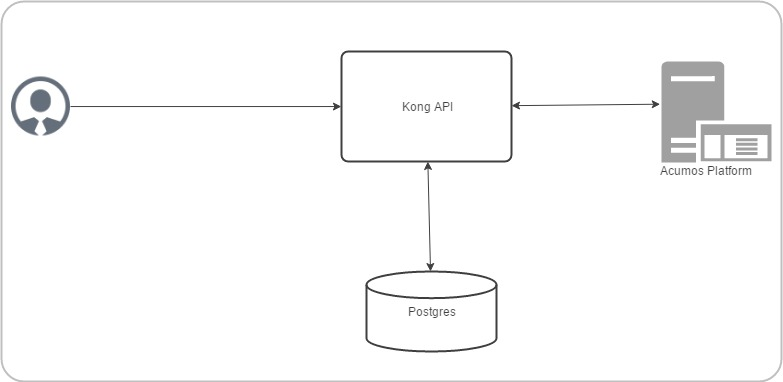

.. ===============LICENSE_START=======================================================
.. Acumos CC-BY-4.0
.. ===================================================================================
.. Copyright (C) 2017-2018 AT&T Intellectual Property & Tech Mahindra. All rights reserved.
.. ===================================================================================
.. This Acumos documentation file is distributed by AT&T and Tech Mahindra
.. under the Creative Commons Attribution 4.0 International License (the "License");
.. you may not use this file except in compliance with the License.
.. You may obtain a copy of the License at
..
.. http://creativecommons.org/licenses/by/4.0
..
.. This file is distributed on an "AS IS" BASIS,
.. WITHOUT WARRANTIES OR CONDITIONS OF ANY KIND, either express or implied.
.. See the License for the specific language governing permissions and
.. limitations under the License.
.. ===============LICENSE_END=========================================================

=============================
System Integration User Guide
=============================

Acumos API Management with Kong
===============================

According to the `Kong website <https://getkong.org/>`_, Kong is a scalable, open source API Layer/Gateway/Middleware. The Acumos Platform uses Kong as a reverse proxy server. SSL certificates are installed on the Kong server so each containerized app doesn't have to install its own certs. Kong is highly configurable. Browse the `Kong documentation <https://getkong.org/docs/>`_ for a detailed description and user guides.

Kong API helps in reducing the rewriting of the same piece of code again and again for SSL certificates configuration in order to make the API secure. Now we don't need to do any coding/configuration work in API anymore.

Backend Architecture

*Note*: All the configuration data sent through the Admin API is stored in Kong's data store. Kong is capable of supporting both Postgres and Cassandra as storage backend. We have chosen Postgres.

Kong API component versions
---------------------------

- postgres:9.4
- kong:0.11.0

Acumos Kong API setup
---------------------

Kong API completely containerized solution is automated with docker compose. It installed with its own docker-compose file.

In dockers-compose definition, there are three services:

- kong-database
- kong-migration
- kong

Kong uses an external datastore to store its configuration such as registered APIs, Consumers and Plugins.
The entire configuration data is stored in Kong's data store. The kong-migration service is used to create the objects in the kong-database. This bootstrap functionality is not provided by kong service, so kong-migration service run once inside the container.

By default Kong listens on the following ports:

	:8000 on which Kong listens for incoming HTTP traffic from your clients, and forwards it to your upstream services.
	
	:8443 on which Kong listens for incoming HTTPS traffic. This port has a similar behavior as the :8000 port, except that it expects HTTPS traffic only. This port can be disabled via the configuration file.
	
	:8001 on which the Admin API used to configure Kong listens.
	
	:8444 on which the Admin API listens for HTTPS traffic.
	
Acumos Kong is running on port

	:7000 on which Acumos Kong listens for incoming HTTP traffic from your clients, and forwards it to your upstream services.
	
	:443 on which Acumos Kong listens for incoming HTTPS traffic. This port has a similar behavior as the :7000 port, except that it expects HTTPS traffic only. This port can be disabled via the configuration file.
	
	:7001 on which the Admin API used to configure Acumos Kong listens.
	
	:7004 on which the Admin API listens for HTTPS traffic.
	
	
*Note*: Acumos Kong API docker-compose.yml and shell script can be run before or after the main docker-compose. Ensure before access the service URL via acumos Kong API all the services which we are going to access should be up and running.
	
Prerequisites
-------------
`Docker <https://docs.docker.com/>`_ and `Docker Compose <https://docs.docker.com/compose/install/>`_ installed

Steps
-----

1. Clone the system-integration repository

.. code-block:: bash

   $ git clone https://gerrit.acumos.org/r/system-integration

2. Builds, (re)creates, starts, and attaches to containers for kong, postgres.

.. code-block:: bash
	
   $ ./docker-compose-kong.sh up -d  	
				

3. To stop the running containers without removing them

.. code-block:: bash	

   $ ./docker-compose-kong.sh stop

Steps to create self signed in certificate
------------------------------------------
1. Create the private server key

.. code-block:: bash

      openssl genrsa -des3 -out server.key 2048

2. Now we create a certificate signing request

.. code-block:: bash

      openssl req -new -key server.key -out server.csr -sha256

3. Remove the passphrase

.. code-block:: bash

      cp server.key server.key.org

.. code-block:: bash

      openssl rsa -in server.key.org -out server.key

4. Signing the SSL certificate

.. code-block:: bash

      openssl x509 -req -in server.csr -signkey server.key -out server.crt -sha256

Acumos API configuration
------------------------

Please update the configuration settings in "secure-acumos-api.sh" script to match your environment:

1.  Copy your host certificate and key under acumos-kong-api "certs" directory

2.  Change the values of placeholders below before running the script

.. code-block:: bash

      export ACUMOS_KONG_CERTIFICATE_PATH=./certs

      export ACUMOS_CRT=localhost.csr

      export ACUMOS_KEY=localhost.key

      export ACUMOS_HOST_NAME=<your hostname>

      export ACUMOS_HOME_PAGE_PORT=8085

      export ACUMOS_CCDS_PORT=8003

      export ACUMOS_ONBOARDING_PORT=8090

Run the "secure-acumos-api.sh" script, Please ensure that Acumos Kong API container is up.

.. code-block:: bash

     ./secure-acumos-api.sh

Expose new service:
-------------------

Use the Admin API port 7001 to configure Kong. Acumos standard sample to expose the service is present in shell script:

.. code-block:: bash

     ./secure-acumos-api.sh

For more details visit `Kong Admin API documentation <https://getkong.org/docs/0.5.x/admin-api/>`_,

Deployment of Acumos platform under Azure-K8s
------------------------------------------------------

.. code-block:: bash

    Introduction

This user guide describes how to deploy Acumos platform using Kubernetes an open-source container-orchestration system for automating deployment, scaling and management of containerized applications under public cloud Azure.

.. code-block:: bash

   What’s included in the acumosk8s public cloud Azure

In system-integration repo folder acumosk8s-public-cloud/azure:

*  deployments/all_start_stop.sh: the main script that kicks off the deployment, to setup
   pods Acumos , elk, docker, kong, nexus ,proxy and mariadb under a kubernetes environment.
*  acumos-kubectl.env: environment setup file that is customized as new environment parameters get generated (e.g. passwords). Used by various scripts in this toolset, to set shell environment variables that they need.  
* deployments/: kubernetes deployment templates for all system components.
*  services/all_start_stop.sh: the script that gets all the services started, to setup
   service for Acumos , elk, docker, kong, nexus ,proxy, mariadb and federation under a kubernetes 
   environment.
* services/: kubernetes service templates for all system components.
* configmap/: kubernetes configmap templates for ELK stack.
* volumeclaim/all_start_stop.sh: the script that creates persistent volume claim for mariadb, nexus ,output,
  web onboarding, federation certificates and acumos logs.

.. code-block:: bash

   Release Scope
   
**Current Release (Athena)**

The Athena release includes these capabilities that have been implemented/tested:

* Multi-Node deployment of the Acumos platform under kubernetes.        
* deployment with a new Acumos database or redeployment with a current database
  and components compatible with that database version.
* Component services under kubernetes as named below (deployed as
  one pod-based service k.a acumos):

  * core components of the Acumos platform

    * Portal Marketplace: acumos
    * Hippo CMS: acumos
    * Solution Onboarding: acumos
    * Design Studio Composition Engine: acumos
    * Federation Gateway: federation-service
    * Azure Client: acumos
    * Common Data Service: acumos
    * Filebeat: acumos
    * Elasticsearch: elasticsearch
    * Logstash: logstash-service
    * Kibana: kibana-service

  * external/dependency components

    * docker engine/API: acumos-docker-service under kubernetes.
    * MariaDB: mariadb running as acumos-mysql service under kubernetes.
    * Kong proxy: running as acumos-kong-proxy , acumos-postgres service under kubernetes.
    * Nexus: running as acumos-nexus-service under kubernetes.
    * Proxy: running as acumos-proxy under kubernetes.

Future Releases
---------------
Future releases may include these new features:

* Scaling up, monitoring health tool.

Prerequisites
-------------

Setup of Kubernetes cluster in Azure and  kubectl, the Kubernetes command-line client ,Tiller to install using helm charts.

Step-by-Step Guide
------------------

1. Clone the system-integration repository.

.. code-block:: bash

   $ git clone https://gerrit.acumos.org/r/system-integration

2. Change directory to  acumosk8s-public-cloud/azure

.. code-block:: bash
	
   $ cd  acumosk8s-public-cloud/azure
				

3. Edit acumos-kubectl.env file to make changes related to latest assembly , database connection , credentials ,etc.

.. code-block:: bash	

   $ vi acumos-kubectl.env

4. Use kubectl create command on kubernetes client machine to create a namespace.

.. code-block:: bash	

   $ kubectl create namespace <namespace name>
   Example: kubectl create namespace acumos-ns01

5. Change directory to  acumosk8s-public-cloud/azure/volumeclaim to create persistent volume claim (pvc).

.. code-block:: bash	

   $ cd  acumosk8s-public-cloud/azure/volumeclaim

6. Edit acumos-volumeclaim.sh file and update variable ENV_FILE for absolute path of acumos-kubectl.env file.

.. code-block:: bash	

   $ vi acumos-volumeclaim.sh

7. Run all-start-stop.sh script under volumeclaim directory. This will create pvc for certs , nexus, output, acumos logs ,webonboarding and mariadb.

.. code-block:: bash	

   $ ./all-start-stop.sh create

8. This step needs to be executed only if all the pvc created earlier needs to be deleted.This will delete all the pvc created under the given namespace.

.. code-block:: bash	

   $ ./all-start-stop.sh delete

9. If each volumeclaim need to be created individually then skip step 7 and use below command.

.. code-block:: bash	

   $ ./acumos-volumeclaim.sh <name of volumeclaim .yaml file> create
   Example: ./acumos-volumeclaim.sh acumos-volumeclaim.yaml create

10. Create a secret file for acumos that contains base64 encoding to pull docker image from nexus repo.

.. code-block:: bash	

   $ log "Create k8s secret for docker image pulling from nexus repo"
     b64=$(cat ~/.docker/config.json | base64 -w 0)
     cat <<EOF >acumos-secret.yaml
     apiVersion: v1
     kind: Secret
     metadata:
       name: acumos-secret
       namespace: acumos-ns01
     data:
       .dockerconfigjson: $b64
     type: kubernetes.io/dockerconfigjson
     EOF

11. Create configmap for ELK stack.

.. code-block:: bash	
   
   $ cd  acumosk8s-public-cloud/azure/configmap
   $ ./acumos-configmap.sh <name of config.yaml file> create
   Example: ./acumos-configmap.sh es-config.yaml create
         ./acumos-configmap.sh logstash-config.yaml create

12. Change directory to  acumosk8s-public-cloud/azure/deployments

.. code-block:: bash	

   $ cd  acumosk8s-public-cloud/azure/deployments

13. Edit acumos-deployment.sh file and update variable ENV_FILE for absolute path of acumos-kubectl.env file.

.. code-block:: bash	

   $ vi acumos-deployment.sh

14. Run all-start-stop.sh script under deployments directory. This will create kubernetes deployment for mariadb ,kong, elk, acumos (containing all components), nexus, docker and proxy.

.. code-block:: bash	

   $ ./all-start-stop.sh create

15. This step needs to be executed only if all the deployment.yaml created earlier needs to be deleted.This will delete kubernetes deployment for mariadb ,kong, elk, acumos (containing all components), nexus, docker and proxy created under the given namespace.

.. code-block:: bash	

   $ ./all-start-stop.sh delete

16. If each deployment need to be created individually then skip step 14 and use below command.

.. code-block:: bash	

   $ ./acumos-deployment.sh <name of deployment.yaml file> create
   Example: ./acumos-deployment.sh acumos-deployment.yaml create

17. Change directory to  acumosk8s-public-cloud/azure/services

.. code-block:: bash	

   $ cd  acumosk8s-public-cloud/azure/services

18. Edit acumos-service.sh file and update variable ENV_FILE for absolute path of acumos-kubectl.env file.

.. code-block:: bash	

   $ vi acumos-service.sh

19. Run all-start-stop.sh script under services directory. This will create kubernetes service for mariadb ,kong, elk, acumos (containing all components), nexus, docker ,federation and proxy. After services are up and running we need to map external endpoints generated for kibana-service , federation-service and acumos-nexus-service to FQDN in azure e.g. IP 40.117.115.236 generated for kibana is mapped to acumosk8s-log.eastus.cloudapp.azure.com

.. code-block:: bash	

   $ ./all-start-stop.sh create

20. This step needs to be executed only if all the services.yaml created earlier needs to be deleted.This will delete kubernetes services for mariadb ,kong, elk, acumos (containing all components), nexus, docker , federation and proxy created under the given namespace.

.. code-block:: bash	

   $ ./all-start-stop.sh delete

21. If each service need to be created individually then skip step 19 and use below command.

.. code-block:: bash	

   $ ./acumos-service.sh <name of service.yaml file> create
   Example: ./acumos-service.sh acumos-service.yaml create

22. Create a certs directory in kubernetes client machine and generate files acumos-k8s.cert , acumos-k8s.key , acumos-k8s.pkcs12 and acumosTrustStore.jks

23. Create certificate and run ./create-certs.sh , this shell file includes below line

.. code-block:: bash	

    openssl req -x509 -newkey rsa:4096 -keyout acumos-k8s.key -out acumos-k8s.cert -days 365

24. Install certificates and run ./install-certificates.sh that includes below line. acumosk8s.eastus.cloudapp.azure.com is the FQDN  and 8001 is port no that is exposed.

.. code-block:: bash	

    curl -i -X POST http://acumosk8s.eastus.cloudapp.azure.com:8001/certificates \
    -F "cert=acumos-k8s.cert" \
    -F "key=acumos-k8s.key" \
    -F "snis=acumosk8s.eastus.cloudapp.azure.com,localhost"

25. Add to certificates run ./add-to-cacert.sh ,  this shell file includes below line.

.. code-block:: bash	

/usr/lib/jvm/java-8-oracle/bin/keytool -import -noprompt -keystore acumosTrustStore.jks -storepass changeit -alias acumos-k8s -file acumos-k8s.pem

26. Generate pkcs12.sh file run ./generate-pkcs12.sh , this file includes below code.

.. code-block:: bash

     #! /bin/bash
     CERT_DIR=/path-to-directory/acumos-k8s/certs
     CERT_FILE=acumos-k8s.cert
     CERT_KEY=acumos-k8s.key
     PKCS12_FILE=acumos-k8s.pkcs12
     openssl pkcs12 -export -nokeys -in ${CERT_DIR}/${CERT_FILE} -out ${CERT_DIR}/${PKCS12_FILE}

27. Give read and execute access to .pkcs12 and .jks file by making use of below command

.. code-block:: bash

     chmod 755 acumosTrustStore.jks
     chmod 755 acumos-k8s.pkcs12

28. Copy acumosTrustStore.jks and acumos-k8s.pkcs12 to volume mounted for federation gateway container. Make use of below commands. In our case /path-to-directory/acumos-k8s/certs/acumos-k8s.pkcs12 is the path where file is located under K8 , acumos-ns01 is the namespace created and acumos-1353575208-c235g is the pod name that contains all the containers including federation-gateway.
/app/certs is the mount directory for federation-gateway container

.. code-block:: bash

     kubectl cp /path-to-directory/acumos-k8s/certs/acumos-k8s.pkcs12 acumos-ns01/acumos-1353575208-c235g:/app/certs/ -c federation-gateway

     kubectl cp /path-to-directory/acumos-k8s/certs/acumosTrustStore.jks acumos-ns01/acumos-1353575208-c235g:/app/certs/ -c federation-gateway

29. After copying .pkcs12 and .jks file restart the federation-gateway pod

30. Run secure-acumos-api-internal.sh file on K8. You need to change few configuration listed below based on your environment in this file 

.. code-block:: bash

  export ACUMOS_KONG_API_HOST_NAME=acumosk8s.eastus.cloudapp.azure.com

  export ACUMOS_KONG_API_HOST_SNIS=acumosk8s.eastus.cloudapp.azure.com

  export ACUMOS_KONG_API_PORT=8001 

  export ACUMOS_KONG_CERTIFICATE_PATH=/path-to-directory/acumos-k8s/certs

  export ACUMOS_CRT=acumos-k8s.cert

  export ACUMOS_KEY=acumos-k8s.key 

  export ACUMOS_HOST_NAME=acumos.acumos-ns01

  export ACUMOS_NEXUS_HOST_NAME=acumos-nexus-service.acumos-ns01

  export ACUMOS_HOME_PAGE_PORT=8085

  export ACUMOS_ONBOARDING_PORT=8090

  export ACUMOS_CMS_PORT=9080

  export ACUMOS_NEXUS_PORT=8001

31. Follow below steps to set up CMS.

 * Login to the Hippo CMS console as "admin/admin", at
   http://<hostname>:<ACUMOS_CMS_PORT>/cms/console, where ACUMOS_CMS_PORT is per
   acumos-kubectl.env; for the default, the address is acumosk8s.eastus.cloudapp.azure.com:9080/cms/console

 * On the left, click the + at ``hst:hst`` and then also at ``hst:hosts``. Click
   the + at the ``dev-env`` entry, and the same for the nodes as they appear:
   ``com, azure, cloudapp, eastus``

 * Right-click on the "acumos-dev1-vm01-core" entry and select "Move node".

 * In the ``Move Node`` dialog, select the ``dev-env`` node, enter "<hostname>"
   at ``To``, and click``OK``. Default hostname is acumosk8s

 * When the dialog closes, you should see your node renamed and moved under
   ``dev-env``. You may also want to save your changes by pressing the
   ``Write changes to repository`` button in the upper right.

 * With the "<hostname>" node selected, click ``Add Property`` from the toolbar.

 * In the ``Add a new Property`` dialog, place your cursor in the ``Name`` field
   and then select ``hst:schemeagnostic``. click ``OK``.

 * Make sure the hostname is selected on the left. Then select the check box
   under the new attribute. This attribute is essential, as internal to the
   Acumos platform the Hippo CMS service is accessed via HTTP, but externally,
   user web browsers access the Acumos portal via HTTPS. Also click the
   ``Write changes to repository`` button on the upper right.

 * Delete the superfluous node. Right-click the ``com`` node, select
   ``Delete node``.

 * Select the ``Save immediately`` check box and click ``OK``

32. Follow below step to set up MariaDB

Run below command to connect to acumos-mysql container.

.. code-block:: bash

   kubectl -n acumos-ns01 exec -it <acumos-mysql-pod name> /bin/sh

Connect to Mariadb.

.. code-block:: bash

   mysql -u root -p <password>

Execute below scripts to create acumos and acumos cms database. e.g we have used CDS but it need to be same mentioned in env file.

.. code-block:: bash

   drop database if exists CDS;
   create database CDS;
   create user 'CDS_USER'@'localhost' identified by 'CDS_PASS';
   grant all on CDS.* to 'CDS_USER'@'localhost';
   create user 'CCDS_USER'@'%' identified by 'CDS_PASS';
   grant all on CDS.* to 'CDS_USER'@'%';

.. code-block:: bash

   drop database if exists acumos_CMS;
   create database acumos_CMS;
   create user 'CMS_USER'@'localhost' identified by 'CMS_PASS';
   grant all on acumos_CMS.* to 'CMS_USER'@'localhost';
   create user 'CMS_USER'@'%' identified by 'CMS_PASS';
   grant all on acumos_CMS.* to 'CMS_USER'@'%';

Execute the DDL and DML scripts for any database version that needs to be configured.

Set up using Helm Charts
------------------------

1. Clone the system-integration repository.

.. code-block:: bash

   $ git clone https://gerrit.acumos.org/r/system-integration

2. Change directory to  acumosk8s-public-cloud/azure/HELM

.. code-block:: bash
	
   $ cd  acumosk8s-public-cloud/azure/HELM

3. Create a secret file for acumos that contains base64 encoding to pull docker image from nexus repo.

.. code-block:: bash	

   $ log "Create k8s secret for docker image pulling from nexus repo"
     b64=$(cat ~/.docker/config.json | base64 -w 0)
     cat <<EOF >acumos-secret.yaml
     apiVersion: v1
     kind: Secret
     metadata:
       name: acumos-secret
       namespace: <namespace name>
     data:
       .dockerconfigjson: $b64
     type: kubernetes.io/dockerconfigjson
     EOF				

4. Use below helm install command on kubernetes client machine to install helm chart for non core components like nexus, mariadb ,etc and elk stack.

.. code-block:: bash	

   $ helm install k8-noncore-chart
   $ helm install k8-elk-chart

5. Follow below step to set up MariaDB

Run below command to connect to acumos-mysql container.

.. code-block:: bash

   kubectl -n <namespace_name> exec -it <acumos-mysql-pod name> /bin/sh

Connect to Mariadb.

.. code-block:: bash

   mysql -u root -p <password>

Execute below scripts to create acumos database. e.g we have used CDS but it need to be same mentioned in env file.

.. code-block:: bash

   drop database if exists CDS;
   create database CDS;
   create user 'CDS_USER'@'localhost' identified by 'CDS_PASS';
   grant all on CDS.* to 'CDS_USER'@'localhost';
   create user 'CDS_USER'@'%' identified by 'CDS_PASS';
   grant all on CDS.* to 'CDS_USER'@'%';

Execute the DDL and DML scripts for any database version that needs to be configured.This is available in common data service gerrit repo.

6. Edit values.yaml file inside k8-acumos-chart to make changes related to latest assembly , database connection , credentials ,onboarding-cli service,etc.

.. code-block:: bash	

   $ cd k8-acumos-chart
   $ vi values.yaml

7. Use below helm install command on kubernetes client machine to install helm chart for acumos core components like portal- fe , portal-be, onboarding,etc.

.. code-block:: bash	

   $ helm install k8-acumos-chart

8. To view and delete the helm charts installed.

.. code-block:: bash	

   $ helm list
   $ helm delete <chart name>

9. Generate certificates using above mentioned steps. Copy acumosTrustStore.jks and acumos-k8s.pkcs12 to volume mounted for federation gateway container. Make use of below commands. In our case /path-to-directory/acumos-k8s/certs/acumos-k8s.pkcs12 is the path where file is located under K8 , acumos-ns01 is the namespace created and acumos-1353575208-c235g is the pod name that contains all the containers including federation-gateway.
/app/certs is the mount directory for federation-gateway container

.. code-block:: bash

     kubectl cp /path-to-directory/acumos-k8s/certs/acumos-k8s.pkcs12 acumos-ns01/acumos-1353575208-c235g:/app/certs/ -c federation-gateway

     kubectl cp /path-to-directory/acumos-k8s/certs/acumosTrustStore.jks acumos-ns01/acumos-1353575208-c235g:/app/certs/ -c federation-gateway

10. After copying .pkcs12 and .jks file restart the federation-gateway pod.

11. To redeploy core components based on weekly assembly use chart k8-acumos-redeploy-chart.

.. code-block:: bash	

   $ helm install k8-acumos-redeploy-chart

12. Run secure-acumos-api-internal.sh file on K8. You need to change few configuration listed below based on your environment in this file 

.. code-block:: bash

  export ACUMOS_KONG_API_HOST_NAME=acumosk8s.FQDN

  export ACUMOS_KONG_API_HOST_SNIS=acumosk8s.FQDN

  export ACUMOS_KONG_API_PORT=8001 

  export ACUMOS_KONG_CERTIFICATE_PATH=/path-to-directory/certificates-is-stored

  export ACUMOS_CRT=acumos-k8s.cert

  export ACUMOS_KEY=acumos-k8s.key 

  export ACUMOS_HOST_NAME=<acumos service name>.<namespace>

  export ACUMOS_NEXUS_HOST_NAME=acumos-nexus-service.<namespace>

  export ACUMOS_HOME_PAGE_PORT=8085

  export ACUMOS_ONBOARDING_PORT=8090

  export ACUMOS_NEXUS_PORT=8001

  
Monitoring resource utilization in kubernetes using Prometheus and Grafana
--------------------------------------------------------------------------

1. Create a folder called prometheus. Here we will create all our monitoring resources.Create a file called prometheus/namespace.yml with the content.

.. code-block:: bash

   kind: Namespace
   apiVersion: v1
   metadata:
     name: prometheus

2. Apply & Test the namespace exists.

.. code-block:: bash

    $ kubectl get namespaces

3. Deploy Prometheus into the prometheus namespace.

.. code-block:: bash

   $ helm install stable/prometheus --namespace prometheus --name prometheus

4. We can confirm by checking that the pods are running.

.. code-block:: bash

    $ kubectl get pods -n prometheus

5. Deploy Grafana into the pometheus namespace.

.. code-block:: bash

   $ helm install stable/grafana --namespace prometheus --name grafana

6. Grafana is deployed with a password. Run below command to get the initial password.The username is admin.

.. code-block:: bash

   $ kubectl get secret --namespace prometheus grafana -o jsonpath="{.data.admin-password}"
    | base64 --decode ; echo

7. Port Forward the Grafana dashboard to see whats happening

.. code-block:: bash

    $ export POD_NAME=$(kubectl get pods --namespace prometheus -l "app=grafana,release=grafana" -o 
      jsonpath="{.items[0].metadata.name}")
    $ kubectl --namespace prometheus port-forward $POD_NAME 3000

8. Go to http://localhost:3000 in your browser. You should see the Grafana login screen.If step 7 gives 
   connectivity issue then we can change type as LoadBalancer in grafana service file that will create an 
   external endpoint and url will be accessible.

9. Set the smtp settings in grafana config map to send email alerts notification.