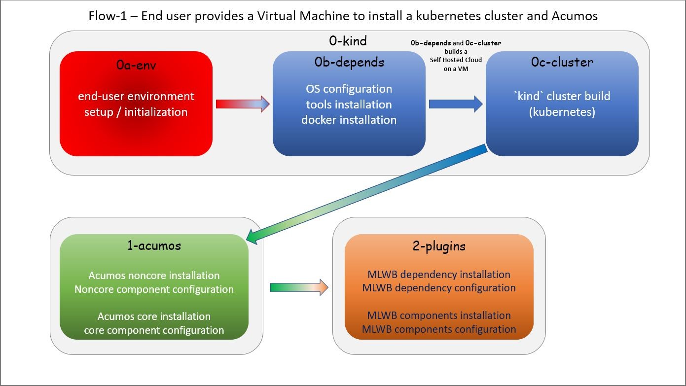
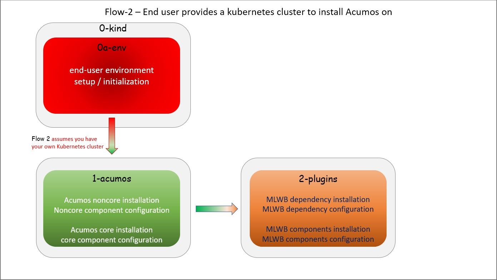

..
.. ===============LICENSE_START=======================================================
.. Acumos CC-BY-4.0
.. ===================================================================================
.. Copyright (C) 2017-2020 AT&T Intellectual Property & Tech Mahindra. All rights reserved.
.. ===================================================================================
.. This Acumos documentation file is distributed by AT&T and Tech Mahindra
.. under the Creative Commons Attribution 4.0 International License (the "License");
.. you may not use this file except in compliance with the License.
.. You may obtain a copy of the License at
..
.. http://creativecommons.org/licenses/by/4.0
..
.. This file is distributed on an "AS IS" BASIS,
.. See the License for the specific language governing permissions and
.. limitations under the License.
.. ===============LICENSE_END=========================================================

=======================================
Zero-to-Acumos (z2a) Installation Guide
=======================================

..

    | NOTE: Document is in development.
    | NOTE: Subject to change.

This installation guide describes how to deploy Acumos using the
`Zero-to-Acumos` (z2a) tool. `z2a` was designed for those who require a simple
and automated way to deploy an Acumos platform.

What is `z2a`?
--------------

`Zero-to-Acumos` (`z2a`) is a collection of shell scripts that have been
assembled to perform a simple set of tasks:  installation and (where possible)
configuration of the Acumos component(s).

`z2a` is composed of two (2) distinct process flows; Flow-1 and Flow-2.
In each flow scenario, installation of additional Acumos plugins is optional
as a follow-on procedure.

What is `z2a` Flow-1?
+++++++++++++++++++++

`z2a` Flow-1 (default) performs an Acumos installation including:

* end-user environment creation;
* VM Operating System preparation;
* `z2a` dependency installation;
* Kubernetes cluster creation; and,
* deployment of Acumos noncore and core components on a single VM.

`z2a` Flow-1 is the original `z2a` process flow targeting development/test
environments where a Kubernetes cluster is built and Acumos is installed from
scratch on a single VM.

Flow-1
^^^^^^

Flow-1 consists of three (3) steps using the following scripts (and descriptions):

- Steps 0[a-c]

  * ``z2a/0-kind/0a-env.sh                    # z2a environment creation``
  * ``z2a/0-kind/0b-depends.sh                # dependency installation and setup``
  * ``z2a/0-kind/0a-cluster.sh                # Kubernetes ('kind') cluster creation``

- Step 1

  * ``z2a/1-acumos/1-acumos.sh                # Acumos noncore and core component setup``

- Step 2 (optional)

  * ``z2a/2-plugins/2-plugins.sh              # Acumos plugins setup (including dependencies)``

..

  NOTE: In Flow-1, the `z2a` environment creation script `0a-env.sh.sh` , will have
  to be executed during the initial setup and again after logging out and logging
  back into a new session.

..

The process flow of `z2a` Flow-1 is depicted in the following diagram.

..

  NOTE: `z2a` (Flow-1) should not be used as a production environment deployment
  tool at this time.  `z2a` (Flow-1) has been primarily designed for development
  and/or test environment installations.  Currently, a key component of `z2a`
  (Flow-1), `kind` -  Kubernetes in Docker - is not recommended for production
  installation or production workloads.

What is `z2a` Flow-2?
+++++++++++++++++++++

`z2a` Flow-2 performs an Acumos installation including:

* end-user environment creation;
* `z2a` dependency installation; and,
* deployment of Acumos noncore and core components on an existing Kubernetes cluster.

The second process flow is a new `z2a` process flow targeting a pre-built Kubernetes
cluster environments. (i.e. BYOC - Bring Your Own Cluster)

Flow-2
^^^^^^

Flow-2 consists of three (3) steps using the following scripts (and descriptions):

- Step 0

  * ``z2a/0-kind/0a-env.sh                    # z2a environment creation``

- Step 1

  * ``z2a/1-acumos/1-acumos.sh                # Acumos noncore and core component setup``

- Step 2 (optional)

  * ``z2a/2-plugins/2-plugins.sh              # Acumos plugins setup (including dependencies)``

The process flow of `z2a` Flow-2 is depicted in the following diagram.

--------------------------------------------
Quickstart Guide to `z2a` Deployment (TL;DR)
--------------------------------------------

Choose a Flow
+++++++++++++

If you have:

1) a vanilla VM (fresh install, no additional tools installed);
2) need to build a k8s cluster; and,
3) want to install Acumos (and optional plugins), then choose Flow-1.

If you have:

1) a pre-built k8s cluster; and,
2) want to install Acumos (and optional plugins), then choose Flow-2.

README-PROXY
^^^^^^^^^^^^

If you are running `z2a` in an environment that requires a proxy, you may need
to configure various items to use that proxy BEFORE you run `z2a`.

  NOTE: You may also need to consult your systems/network administration team
  for the correct proxy values.

Please consult the README-PROXY document for details on the various items that
will require configuration and links to resources that will assist in the
configuration tasks.

TL;DR Flow-1
++++++++++++

Here are the steps to execute `z2a` Flow-1.

  NOTE: ``/usr/local/bin`` is a required element in your $PATH

1. Obtain a Virtual Machine (VM) with sudo access ; Login to the VM
2. Install `git` distributed version-control tool
3. For RPM-based distributions such as RHEL/CentOS, execute the `yum` command,
   shown below:
4. For Debian-based distributions such as Ubuntu, execute the `apt-get`
   command, shown below:
5. Make `src` directory ; change directory to that location
6. Clone the Acumos 'system-integration' repo using `git`
7. Set the ACUMOS_HOME environment variable
8. Change directory to the `z2a` directory

Here are the commands to execute:

.. code-block:: bash

    # Login to your VM
    $ sudo yum install -y git
    $ sudo apt-get install --no-install-recommends -y git
    $ mkdir -p $HOME/src ; cd $HOME/src
    $ git clone https://gerrit.acumos.org/r/system-integration
    $ ACUMOS_HOME=$HOME/src/system-integration
    $ cd $ACUMOS_HOME/z2a
..

Next, we must choose one of the following methods to create a
``global_value.yaml`` file.

Flow-1 - example values method
^^^^^^^^^^^^^^^^^^^^^^^^^^^^^^

To use the example `global_value.yaml` file; copy the example values from
``~/z2a/dev1`` to the ``helm-charts`` directory using the following command:

.. code-block:: bash

    $ cp ./dev1/global_value.yaml.dev1 ../helm-charts/global_value.yaml
..

Flow-1 - customized values method
^^^^^^^^^^^^^^^^^^^^^^^^^^^^^^^^^

To use a customized global_value.yaml file;
edit ``$HOME/src/system-integration/helm-charts/global_value.yaml``
using an editor (``vi, nano, pico`` etc.) and command similar to this:

.. code-block:: bash

    $ vi $HOME/src/system-integration/helm-charts/global_value.yaml
..

Once the ``global_value.yaml`` file has been copied or edited; you can proceed with
the installation.

| # Execute ``0-kind/0a-env.sh`` (setup user environment)
| # Execute ``0-kind/0b-depends.sh`` (install / configure dependencies)

.. code-block:: bash

    $ ./0-kind/0a-env.sh
    $ ./0-kind/0b-depends.sh
..

| # LOG OUT OF SESSION ; LOG IN TO NEW SESSION (this step is required for Docker group inclusion)
| # Reinitialize the user z2a environment by running ``0-kind/0a-env.sh``
| # Execute ``0-kind/0c-cluster.sh`` (build and configure k8s cluster)

.. code-block:: bash

    # Logout and Login to your VM
    $ ACUMOS_HOME=$HOME/src/system-integration
    $ cd $ACUMOS_HOME/z2a
    $ ./0-kind/0a-env.sh
    $ ./0-kind/0c-cluster.sh
..

| # Ensure all k8s Pods created are in a 'Running' state.
| # Execute ``1-acumos/1-acumos.sh`` (install / configure noncore & core Acumos components)

.. code-block:: bash

    $ kubectl get pods -A
    $ ./1-acumos/1-acumos.sh
..

If Acumos plugins are to be installed in a new session:
copy the ``ACUMOS_HOME`` line below and paste it into the command-line.

.. code-block:: bash

  $ ACUMOS_HOME=$HOME/src/system-integration

| # To install Acumos plugins ;
| # copy the example MLWB values file into ~/helm-charts
| # Execute ``2-plugins/2-plugins.sh`` (install / configure Acumos plugins and dependencies)

.. code-block:: bash

    $ cp $ACUMOS_HOME/z2a/dev1/mlwb_value.yaml.mlwb $ACUMOS_HOME/helm-charts/mlwb_value.yaml
    $ ./2-plugins/2-plugins.sh
..

TL;DR (Flow-2)
++++++++++++++

To execute Flow-2, we will use a VM-based host for command & control.
Here are the steps to execute `z2a` Flow-2.

  NOTE: You MAY require sudo access on the command & control VM to allow you to install `git`
  NOTE: ``/usr/local/bin`` is a required element in your $PATH

1. Login to the command and control VM
2. Install `git` distributed version-control tool
3. For RPM-based distributions such as RHEL/CentOS, execute the `yum` command, shown below:
4. For Debian-based distributions such as Ubuntu, execute the `apt-get` command, shown below:
5. Make `src` directory ; change directory to that location
6. Clone the Acumos 'system-integration' repo using `git`
7. Set the ACUMOS_HOME environment variable
8. Change directory to the `z2a` directory

.. code-block:: bash

    # Login to your command & control VM
    $ sudo yum install -y git
    $ sudo apt-get install --no-install-recommends -y git
    $ mkdir -p $HOME/src ; cd $HOME/src
    $ git clone https://gerrit.acumos.org/r/system-integration
    $ ACUMOS_HOME=$HOME/src/system-integration
    $ cd $ACUMOS_HOME/z2a
..

Next, we must choose one of the following methods to create a ``global_value.yaml`` file.

Flow-2 - example values method
^^^^^^^^^^^^^^^^^^^^^^^^^^^^^^

To use the example ``global_value.yaml`` file;
copy the example values from ``z2a/dev1`` to the ``helm-charts`` directory

.. code-block:: bash

    $ cp ./dev1/global_value.yaml.dev1 ../helm-charts/global_value.yaml
..

Flow-2 - customized values method
^^^^^^^^^^^^^^^^^^^^^^^^^^^^^^^^^

To use a customized ``global_value.yaml`` file;
edit ``$HOME/src/system-integration/helm-charts/global_value.yaml``
using an editor (``vi, nano, pico,`` etc.) and command similar to this:

.. code-block:: bash

    $ vi $HOME/src/system-integration/helm-charts/global_value.yaml
..

Once the ``global_value.yaml`` file has been copied or edited;
you can proceed with the installation.
Here are the next steps:

1. Execute ``0-kind/0a-env.sh`` (setup user environment)
2. Ensure all k8s Pods are in a 'Running' state.
3. Execute ``1-acumos/1-acumos.sh`` (install / configure noncore & core Acumos components)

.. code-block:: bash

    $ ./0-kind/0a-env.sh
    $ kubectl get pods -A
    $ ./1-acumos/1-acumos.sh
..

If Acumos plugins are to be installed in a new session:
copy the ``ACUMOS_HOME`` line below and paste it into the command-line.

.. code-block:: bash

  $ ACUMOS_HOME=$HOME/src/system-integration

To install Acumos plugins;

1. Copy the example MLWB values file into ``$HOME/src/system-integration/helm-charts/``
2. Execute ``2-plugins/2-plugins.sh`` (install / configure Acumos plugins and dependencies)

.. code-block:: bash

    $ cp $ACUMOS_HOME/z2a/dev1/mlwb_value.yaml.mlwb $ACUMOS_HOME/helm-charts/mlwb_value.yaml
    $ ./2-plugins/2-plugins.sh
..

End TL;DR

----------------
z2a Requirements
----------------

* A SSH client with port-forward/tunnel/proxy capabilities; such as:

  - PuTTY (Windows SSH client)
  - SecureCRT (MacOS SSH client)
  - OpenSSH (Linux SSH client)

Flow-1 Requirements
+++++++++++++++++++

* A Virtual Machine (VM)

  - The user **must** have sudo rights on the VM
    (i.e. must exist in the ``/etc/sudoers`` file).
  - The VM requires Internet access such that OS updates, OS supplemental
    packages and Helm chart installations can be performed. Either the VM has
    proxied access to the Internet or the user must be able to configure the
    proxy setting for the VM.

Flow-2 Requirements
+++++++++++++++++++

* A Kubernetes (k8s) cluster

* A command & control VM which will be used as the installation launch point
  for `z2a`

  - The user **must** have sudo rights on the VM
    (i.e. must exist in the ``/etc/sudoers`` file).
  - The VM requires Internet access such that OS updates, OS supplemental
    packages and Helm chart installations can be performed. Either the VM
    has proxied access to the Internet or the user must be able to configure
    the proxy setting for the VM.

Proxy Requirements
++++++++++++++++++

  NOTE: `z2a` assumes that the VM has Internet access (with no proxies present).

  NOTE: Internet proxy configurations are beyond the scope of the installation
  documentation.

  Please consult the README-PROXY document for details on the various items
  that will require configuration and links to resources that will assist in
  the configuration tasks.

Misc. Requirements
++++++++++++++++++

* z2a requires that the following tools be installed on the VM prior to execution of the `z2a` scripts:

  - git (the distributed source code management tool)
  - yq (the YAML file processing tool)

Assumptions
+++++++++++

It is assumed that the user who is performing this installation:

* is familiar with Linux (i.e. directory creation, shell script execution,
  editing files, reading log files etc.)
* has `sudo` access (elevated privileges) to the VM where the installation
  will occur (Flow-1)
* has `sudo` access (elevated privileges) to the VM where the installation
  onto the k8s cluster will occur (Flow-2)

Getting Started
---------------

  NOTE: `z2a` depends on being able to reach a number of up-to-date software
  repositories.  All efforts have been made to not bypass distribution-specific
  package managers and software update facilities.

Installation Location Creation (Flow-1 and Flow-2)
++++++++++++++++++++++++++++++++++++++++++++++++++

In the following section, the user will perform the following actions:

1. Login to the Linux VM where the install will occur
2. Install the 'git' distributed version-control tool
3. Create a new directory that will be used to perform this installation (i.e. `src`)
4. Change directory into this new directory
5. Clone the gerrit.acumos.org `system-integration` repository into the new directory
6. Change directory into the newly created `system-integration` directory

After completing Step #1 above (log into the VM), here are the commands to
execute steps 2-6 above.

.. code-block:: bash

  # Install 'git' distributed version-control tool
  # For RPM-based distributions such as RHEL/CentOS, execute the following command:
  $ sudo yum install -y git
  # For Debian-based distributions such as Ubuntu, execute the following command:
  $ sudo apt-get install --no-install-recommends -y git
  $ mkdir -p $HOME/src
  $ cd $HOME/src
  $ git clone https://gerrit.acumos.org/r/system-integration
  $ cd $HOME/src/system-integration
..

Next, we will inspect the contents of the directory structure that was just
created by the ``git clone`` command above.

.. code-block:: bash

  $ ls -l
  total 20
  drwxr-xr-x. 16 userID groupID 4096 Mar 19 13:30 AIO
  drwxr-xr-x.  3 userID groupID   19 Mar 19 13:30 acumosk8s-public-cloud
  drwxr-xr-x.  9 userID groupID  117 Mar 19 13:30 charts
  drwxr-xr-x.  4 userID groupID  107 Mar 19 13:30 docs
  drwxr-xr-x.  5 userID groupID   87 Mar 20 11:03 helm-charts
  drwxr-xr-x.  2 userID groupID  196 Mar 19 13:30 tests
  drwxr-xr-x.  4 userID groupID 4096 Mar 19 13:30 tools
  drwxr-xr-x.  5 userID groupID  235 Mar 20 18:35 z2a
  -rw-r--r--.  1 userID groupID 1281 Mar 19 13:30 INFO.yaml
  -rw-r--r--.  1 userID groupID  770 Mar 19 13:30 LICENSE.txt
  -rw-r--r--.  1 userID groupID 1388 Mar 19 13:30 README.md
..

In the directory listing shown above, two (2) directories are of special interest:

  * ``helm_charts`` is the location of the Acumos core Helm charts used in this
    installation process
  * ``z2a`` is the location of the `z2a` scripts and supporting utilities.  We
    will refer to that directory as the Z2A_BASE directory.  This directory
    also contains some of the Acumos noncore dependency Helm charts.

  NOTE: The `z2a` installation log files will be created in the Z2A_BASE directory.

Using the Example `global_value.yaml` File
++++++++++++++++++++++++++++++++++++++++++

z2a includes example ``global_value.yaml`` files for Acumos in the
``$ACUMOS_HOME/z2a/dev1`` directory. These example Acumos values files are
provided for both illustrative purposes and to assist in performing a quick
installation (see: TL;DR section).

The example Acumos values file can be used for a test installation and
additional edits should not be required.

The commands to use the Acumos example values are:

.. code-block:: bash

  $ ACUMOS_HOME=$HOME/src/system-integration
  $ cp $ACUMOS_HOME/z2a/dev1/global_value.yaml.dev1 $ACUMOS_HOME/z2a/helm-charts/global_value.yaml
..

  NOTE: The Acumos example values can be used for a private development
  environment that is non-shared, non-production and not exposed to the
  Internet.  The values provided in the Acumos example file are for
  demonstration purposes only.

Editing the `global_value.yaml` File
++++++++++++++++++++++++++++++++++++

The ``global_value.yaml`` file is located in the ``ACUMOS_$HOME/helm_charts``
directory.  We will need to change directories into that location to perform
the necessary edits required for the Acumos installation or use the examples
values noted above.

Before starting to edit the ``global_value.yaml`` file, create a copy of the
original file just in case you need to refer to the original or to recreate
the file.

Here are the commands to execute to accomplish the next tasks.

.. code-block:: bash

  $ cd $ACUMOS_HOME/helm-charts
  $ cp global_value.yaml global_value.orig
..

The default ``global_value.yaml`` file requires the user to make edits to the
masked values in the file.  Masked values are denoted by six (6) 'x' as shown:
"xxxxxx"

All entries with the masked values must be changed to values that will be used
during the installation process. Below is an example edit of a snippet of the
``global_value.yaml`` file, where the values for *namespace* and *clusterName*
are edited.

Using your editor of choice (vi, nano, pico etc.) please open the
``global_value.yaml`` file such that we can edit it's contents.

Before edit (these are examples - please substitute values that are appropriate
for your environment):

.. code-block:: bash

  global:
    appVersion: "1.0.0"
    namespace: "xxxxxx"
    clusterName: "xxxxxx"
..

After edit: (Example 1)

.. code-block:: bash

  global:
    appVersion: "1.0.0"
    namespace: "acumos-dev1"
    clusterName: "kind-acumos"
..

After edit: (Example 2)

.. code-block:: bash

  global:
    appVersion: "1.0.0"
    namespace: "z2a-test"
    clusterName: "kind-acumos"
..

For entries in the ``global_value.conf`` file that have an existing entry, do
not edit these values as they are essential for correct installation.

Flow-1 Installation Process
+++++++++++++++++++++++++++

To perform an installation of Acumos, we will need to perform the following
steps:

1. Change directory into the `z2a/0-kind` directory.

.. code-block:: bash

    $ cd $ACUMOS_HOME/z2a/0-kind

2. Execute the z2a `0a-env.sh` script.

.. code-block:: bash

    $ ./0a-env.sh

3. After successful execution of the `0a-env.sh` script, execute the z2a `0b-depends.sh` script.

.. code-block:: bash

    $ ./0b-depends.sh

4. Once the z2a `0b-depends.sh` has completed, please log out of your session
and log back in.  This step is required such that you (the installer) are
added to the `docker` group, which is required in the next step.

.. code-block:: bash

    $ logout

5. Once you are logged back into the VM, change directory into the `z2a/0-kind`
directory and execute the z2a `0c-cluster.sh` script.

.. code-block:: bash

    $ ACUMOS_HOME=$HOME/src/system-integration
    $ cd $ACUMOS_HOME/z2a/0-kind
    $ ./0c-cluster.sh

6. After the z2a ``z2a/0-kind/0c-cluster.sh`` script has completed, we will
need to check the status of the newly created Kubernetes pods before we proceed
with the Acumos installation.  We can ensure that all necessary Kubernetes pods
are running by executing this `kubectl` command.

.. code-block:: bash

    $ kubectl get pods -A

7. When all Kubernetes pods are in a `Running` state, we can proceed and
execute the `1-kind.sh` script to install and configure Acumos.

.. code-block:: bash

    $ cd $ACUMOS_HOME/z2a/1-acumos
    $ ./1-acumos.sh

8. The last step is to check the status of the Kubernetes pods create during
the Acumos installation process.

.. code-block:: bash

    $ kubectl get pods -A

When all Kubernetes pods are in a `Running` state, the installation of the
Acumos noncore  and core components has been completed.

Flow-2 Installation Process
+++++++++++++++++++++++++++

To perform an installation of Acumos using the Flow-2 technique, we will need
to perform the following steps:

  NOTE:  The ``global_value.yaml`` file must be edited to provide the correct
  *clusterName* and *namespace*.  Please refer to the previous section on
  performing the edits to the ``global_value.yaml`` file.

1. Change directory into the ``z2a/0-kind`` directory, and execute the
``z2a/0-kind/0a-env.sh`` script.

.. code-block:: bash

    $ ACUMOS_HOME=$HOME/src/system-integration
    $ cd $ACUMOS_HOME/z2a/0-kind
    $ ./0a-env.sh

2. After successful execution of the ``z2a/0-kind/0a-env.sh`` script, execute
the ``z2a/1-acumos/1-kind.sh`` script to install and configure Acumos.

.. code-block:: bash

    $ cd $ACUMOS_HOME/z2a/1-acumos
    $ ./1-acumos.sh

3. The last step is to check the status of the Kubernetes pods create during
the Acumos installation process.

.. code-block:: bash

    $ kubectl get pods -A

When all Kubernetes pods are in a `Running` state, the installation of the
Acumos noncore and core components has been completed.

Acumos Plugin Installation
--------------------------

MLWB
++++

Machine Learning WorkBench is installed during the ``2-plugins`` steps of the
installation process discussed in this document.  Below are details of the
installation process.

Editing the `mlwb_value.yaml` File
++++++++++++++++++++++++++++++++++

  NOTE: `z2a` includes an example value file for MLWB in the
  ``$HOME/src/system-integration/z2a/dev1`` directory.  The MLWB example values
  file is provided for both illustrative purposes and to assist in performing
  a quick installation.  The example MLWB values file from that directory could
  be used here and these edits are not required.

The commands to use the MLWB example values are:

.. code-block:: bash

  $ ACUMOS_HOME=$HOME/src/system-integration
  $ cp $ACUMOS_HOME/z2a/dev1/mlwb_value.yaml.mlwb $ACUMOS_HOME/z2a/helm-charts/mlwb_value.yaml

The MLWB example values can be used for a private development environment that
is non-shared, non-production and not exposed to the Internet.  The values in
the MLWB example file are for demonstration purposes only.

The ``mlwb_value.yaml`` file is located in the
``$HOME/src/system-integration/helm_charts`` directory.  We will need to change
directories into that location to perform the edits necessary to perform the
installation.

Before starting to edit the ``mlwb_value.yaml`` file, create a copy of the original
file just in case you need to refer to the original or to recreate the file.

Here are the commands to execute to accomplish the next tasks.

.. code-block:: bash

  $ cd $ACUMOS_HOME/helm-charts
  $ cp mlwb_value.yaml mlwb_value.orig

The default ``mlwb_value.yaml`` file requires the user to make edits to the
masked values in the file. Masked values are denoted by six (6) 'x' as shown:
"xxxxxx"

Using your editor of choice (vi, nano, pico etc.) please open the
``mlwb_value.yaml`` file such that we can edit it's contents.

*CouchDB* - the following CouchDB values need to be populated in the
``mlwb_value.yaml`` file before installation of the MLWB CouchDB dependency.

.. code-block:: bash

  # CouchDB
  acumosCouchDB:
    createdb: "true"
    dbname: "xxxxxx"
    host: "xxxxxx"
    port: "5984"
    protocol: "http"
    pwd: "xxxxxx"
    user: "xxxxxx"

*JupyterHub* - the following JupyterHub values need to be populated in the
``mlwb_value.yaml`` file before installation of the MLWB JupyterHub dependency.

.. code-block:: bash

  # JupyterHub
  acumosJupyterHub:
    installcert: "false"
    storepass: "xxxxxx"
    token: "xxxxxx"
    url: "xxxxxx"
  acumosJupyterNotebook:
    url: "xxxxxx"

*NiFi* - the following NiFi values need to be populated in the
``mlwb_value.yaml`` file before installation of the MLWB NiFi dependency.

.. code-block:: bash

  # NIFI
  acumosNifi:
    adminuser: "xxxxxx"
    createpod: "false"
    namespace: "default"
    registryname: "xxxxxx"
    registryurl: "xxxxxx"
    serviceurl: "xxxxxx"

MLWB Installation
+++++++++++++++++

To perform an installation of MLWB, we will need to perform the following steps:

1. Change directory into the ``z2a/2-plugins`` directory
2. Execute the ``2-plugins.sh`` script which install the MLWB dependencies and the MLWB components

.. code-block:: bash

  $ ACUMOS_HOME=$HOME/src/system-integration
  $ cd $ACUMOS_HOME/z2a/2-plugins
  $ ./2-plugins.sh

Addendum
--------

Additional Documentation
++++++++++++++++++++++++

Below are links to supplementary sources of information.

Kind: https://kind.sigs.k8s.io/

For post-installation Machine Learning WorkBench configuration steps, please
see the MLWB section of the CONFIGURATION document.

TODO: Add section on accessing the Acumos Portal once installation is completed.

:Created:           2020/07/13
:Last Modified:     2020/07/21
